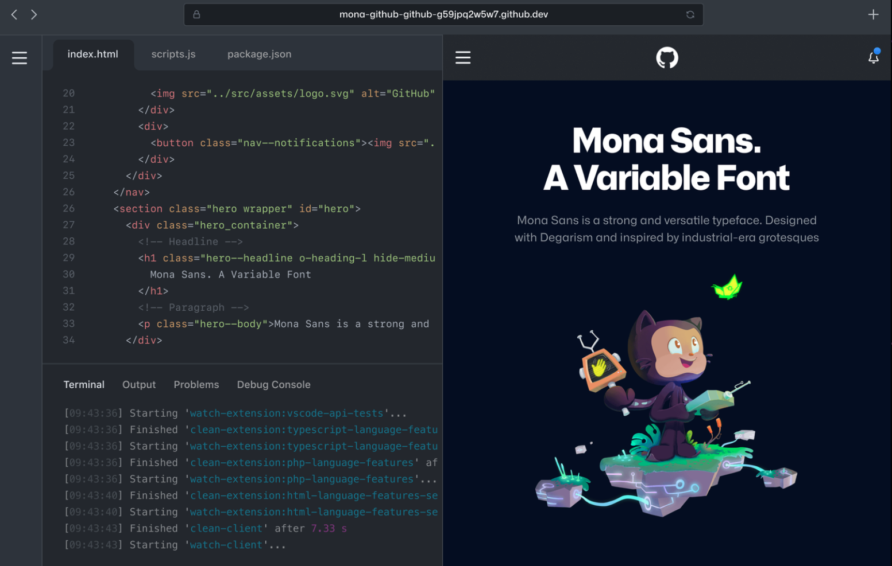
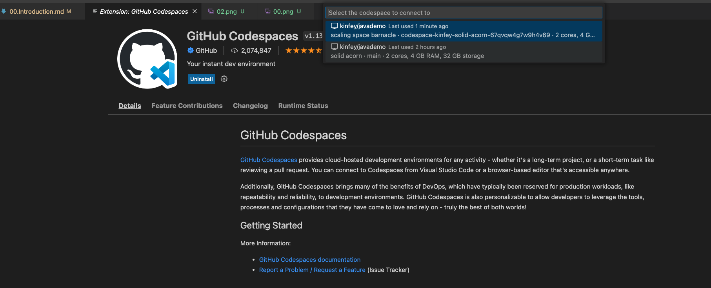

# **GitHub Codespaces 介绍**

GitHub Codespaces 可以让你在 GitHub 不仅可以像往常一样维护你的代码，现在还可以编译你的项目，让你可以直接通过云端直接完成你的研发任务以及开源项目的内容。通过 GitHub Codespaces 你可以在任意设备上，随时随地进行编程语言的学习，项目研发，以及代码维护。最大的优势是，你不用再为学习或完成一个应用，而花任何时间配置不同的环境，而且可以快速在任何地方任何设备维护你的项目。在 GitHub Universe 2022 上，每位 GitHub 用户都可以每个月独享 60 小时的使用时间。

## **什么是 GitHub Codespaces**

GitHub Codespaces 是托管在云中的开发环境。 您可以通过将配置文件提交到您的 Repo（通常称为配置即代码）来为 GitHub Codespaces 自定义项目，这会为项目的所有用户创建可重复的 GitHub Codespaces 配置。每个代码空间都在 GitHub 托管的虚拟机上运行。 您可以根据需要的资源选择要使用的机器类型。 提供需要提供各种类型的机器。您可以从浏览器、Visual Studio Code、JetBrains Gateway 应用程序或使用 GitHub CLI 连接到代码空间。

GitHub Codespaces 面向个人，也面向企业开发。只要你的设备有浏览器就可以使用 GitHub Codespaces ，让你更高效地编写和管理你的代码。

## **如何使用 GitHub Codespaces**

### **场景一**

登录你的 GitHub ，在上方导航栏，选择 "Codespaces" ，就可以进入你的 Codespaces 环境。

你可以基于不同模版，创建你不同的应用，现阶段模版还是有限，主要针对 Python , Ruby , 以及 JavaScript 技术上，当然你也可以通过空模版去搭建基于不同编程语言的不同应用场景的解决方案

### **场景二**

如果你希望针对一个 GitHub 上的 Repo ， 也可以 fork 后，选择 Codespaces ，进入相对应的环境

### **场景三**

你可以通过本地的 Visual Studio Code 以及 Jetbrains 的相关 IDE ，启用你的 Codespaces

## **关于 GitHub Codespaces 的环境设置**

### **云端硬件**

在 GitHub Codespaces 上有不同的硬件，你可以根据自己的需求构建更好的硬件

你可以根据项目的变化去修改相关的内容

### **关于 Dev container**

当您在 GitHub Codespaces 中工作时，您工作的环境是使用托管在虚拟机上的开发容器或开发容器创建的。

开发容器或开发容器是专门配置为提供功能齐全的开发环境的 Docker 容器。 每当您在代码空间中工作时，您就是在虚拟机上使用开发容器。

您可以为存储库配置开发容器，以便为该存储库创建的代码空间为您提供量身定制的开发环境，并配备处理特定项目所需的所有工具和运行时。 如果您未在存储库中定义配置，则 GitHub Codespaces 将使用默认配置，其中包含您的团队在开发项目时可能需要的许多常用工具。

开发容器的配置文件包含在存储库的 .devcontainer 目录中。 您可以使用 Visual Studio Code 为您添加配置文件。 您可以从各种项目类型的预定义配置中进行选择。 您可以在没有进一步配置的情况下使用它们，或者您可以编辑配置以改进它们生成的开发环境。

devcontainer.json 里面可以添加不同的语言环境，不同的 SDK ，以及不同云端的支持，以及端口配置，还可以设定你项目所需要的不同插件。你还可以根据不同需要去定义配置更多的内容。

### **通过模版开发不同的应用**

现在通过模版你可以快速创建 Rudy，Python，以及 JavaScript 技术栈的相关内容，这里以一个 Flask 应用为例，来创建一个通过 GitHub Codespaces 维护的应用。

### **通过空模版来搭建编程环境**

如果你是 .NET , Java , Rust 或者 Go 编程语言的用户，你也可以通过空模版的方式去完成相关的编程语言学习。这里我以 .NET 为例，来和大家说说如何构建一个 .NET 项目。

具体请参考 <a href="./01.LearnCSharp.md">点击进入了解更多</a>

## **相关资源**

0. 注册你的 GitHub https://github.com/signup 

1. 了解 GitHub Codespaces https://github.com/features/codespaces 

2. 学习 Flask 的相关知识 https://learn.microsoft.com/en-us/training/modules/python-flask-build-ai-web-app/

3. 学习 .NET 的相关知识 https://learn.microsoft.com/zh-cn/dotnet/csharp/programming-guide/ 

