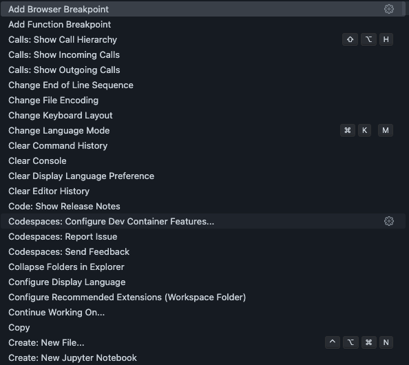
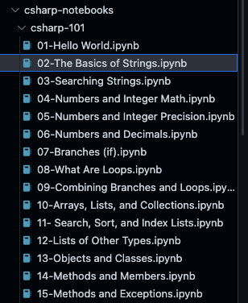

# **在 GitHub Codespace 上学习 C#**

.NET 在 2016 年开源后，成为了一个跨应用场景，跨平台的技术。你可以通过 C# 编写网页，桌面应用，游戏，物联网，移动应用，云计算，大数据等应用。我们可以通过 GitHub Codespace 学习与 .NET 相关的内容。本次练习我们通过 GitHub Codespace 构建简单的控制台，用，以及云计算的应用。

## **场景一：构建控制台应用**

1. 在 GitHub Codespace 上选择空模版，构建一个 GitHub Codespace 的模版

<div style="text-align:center">
 
</div>

2. 如果你是 Windows / Linux 用户 ，请使用 Ctrl + Shift + P ，如果你是 macOS 用户请使用 Cmd + Shift + P，选择 Codespaces: Configure Dev Container Features...

<div style="text-align:center">
 
</div>

3. 选择 C#（.NET）devcontainer 


<div style="text-align:center">
 
</div>

4. 选择 .NET 7

<div style="text-align:center">
 
</div>

5. 设置成功后，选择 Rebuild

6. 在打开的 GitHub Codespace 上，打开控制台，输入以下命令，查看 .NET SDK 的相关信息

```bash

dotnet --version

```

<div style="text-align:center">
 
</div>

7. 在终端中，输入以下命令创建一个最简单的 .NET 控制台命令


```bash

dotnet new console -o HelloWorldApp

```


8. 在 GitHub Codespace 上选择 Run and Debug ，选择 .NET 5+ and .NET Core , 直接运行


<div style="text-align:center">
 
</div>

9.  结束 Debug ，可以设置断点，再运行看看

<div style="text-align:center">
 
</div>

这就是你的第一个在 GitHub Codespace 构建的 .NET 应用程序，你可以继续进入下一个场景的学习。


## **场景二：在 GitHub Codespace  学习 C#**

作为入门者我们需要学习 C# 的语法，传统的语法学习我们需要 IDE ，但是现在我们可以通过 Notebook 进行 C# 编程的学习

0. 创建一个 GitHub Codespace ， 通过空模版创建一个 .NET 6 的开发环境

1. 在 GitHub Codespace 的 Extension 查找 Polyglot Notebooks ，并安装


<div style="text-align:center">
 
</div>


2. 打开 GitHub Codespace 的终端，输入以下命令

```bash

git clone https://github.com/kinfey/csharp-notebooks.git

```

3. 选择目录 csharp-notebooks 下的子目录 csharp-101


<div style="text-align:center">
 
</div>

4. 选择 02-The Basics of Strings.ipynb ，选择 Run All 按钮


<div style="text-align:center">
 
</div>

你现在可以通过交互式的方式学习 C# 编程语言，比过往需要配置 IDE 的方式更加简洁了。希望结合 CSharp 101 打开你的 C# 编程之路。


## **场景三：构建一个 Minimal API 的 GitHub Codespace 环境**

如果你学习完 C# 编程语言，你希望做一些微服务的工作，你可以通过 .NET 构建 Minmal API 。

1. 创建一个 GitHub Codespace ， 通过空模版创建一个 .NET 7 的开发环境

2. 通过命令行构建一个 Minimal API

```bash

dotnet new web -o DemoAPI

```

3. 直接通过 Debug 运行

4. 这里需要把 Port 设置为 Public


<div style="text-align:center">
 
</div>

5. 你也可以安装 Thunder Client 的插件直接用 localhost 直接访问


<div style="text-align:center">
 
</div>

## **相关资源**

1. 了解 GitHub Codespace
   
2. 学习 C#
   
3. C# 101 学习手册
   
4. 学习 .NET  Minimal API


