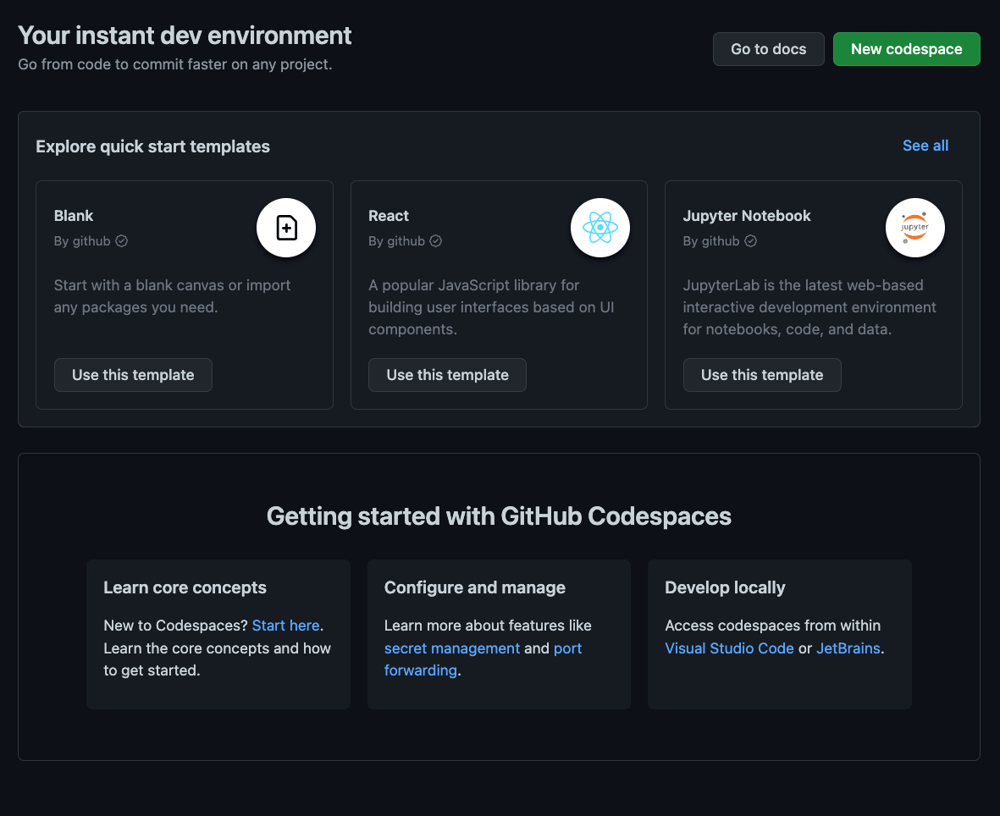
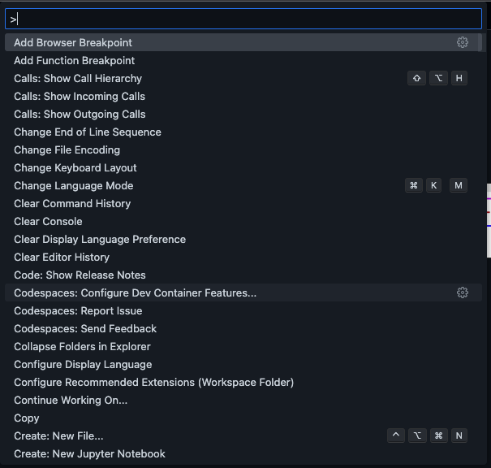
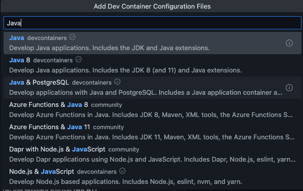
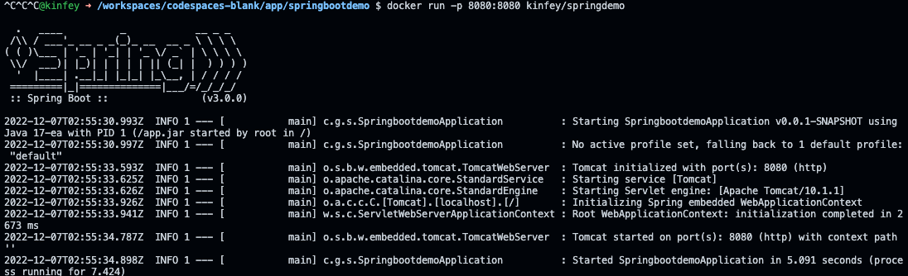

# **在 GitHub Codespaces 上学习 Java**

Java 是非常古老的编程语言，在现代很多场景都在使用 ，如果你是一名 Java 初哥，你一定会为环境变量的设置烦恼，配置 JDK 等对于初学者都是非常困难的。 GitHub Codespaces 可以为你节省环境配置的所有时间，让你可以快速进入 Java 的学习当中。

下面是几个场景的例子，希望能给学习 Java 的初学者一些指引

## **场景一：在 GitHub Codespaces 上快速启用 Java 开发环境**

1. 在 GitHub Codespaces 上选择空模版 


<div style="text-align:center">
  
</div>

2. 如果你是 Windows / Linux 用户 ，请使用 Ctrl + Shift + P ，如果你是 macOS 用户请使用 Cmd + Shift + P，选择添加 Add Dev Container Configuration Files

<div style="text-align:center">
  
</div>

3. 在搜索框选择 Java

<div style="text-align:center">
  
</div>

  并选择 Java 17 的版本

<div style="text-align:center">
  
</div>

  你可以选择基于 Maven 或者 Gradle 的方式，这里我选择 Maven

<div style="text-align:center">
  
</div>

  我们还需要添加 Docker from Docker 给后面场景使用


<div style="text-align:center">
  
</div>

4. 选择右下方出现的 Rebuild 

<div style="text-align:center">
  
</div>

5. 稍等片刻就可以进入新创建的 Java 开发环境，你可以从 GitHub Codespaces 上的插件列表看到，把最基本 Java 开发的组件都已经配置好了 

<div style="text-align:center">
  
</div>

6. 在 GitHub Codespaces 启动终端，执行以下命令，输入以下命令，你可以看到相关内容

```bash

java --version

```

<div style="text-align:center">
  
</div>


```bash

docker --version

```

<div style="text-align:center">
  
</div>


## **场景二：构建 Spring Boot 上的应用**

基于场景一的开发环境，你可以通过 Spring Boot 构建你的微服务，也是最常用的方式，这和我们在 Visual Studio Code 构建 Java 的方式是一样的。

1. 如果你是 Windows / Linux 用户 ，请使用 Ctrl + Shift + P ，如果你是 macOS 用户请使用 Cmd + Shift + P，选择 Java : Create Java Project


<div style="text-align:center">
  
</div>

2. 选择创建 Spring Boot 项目

<div style="text-align:center">
  
</div>

  如果你是第一次使用，会安装 Spring Boot 的支持插件，完成后需要重复第一，第二步的操作

<div style="text-align:center">
  
</div>

  选择 Spring Boot 的版本

<div style="text-align:center">
  
</div>

  语言 Java

<div style="text-align:center">
  
</div>

  添加好命名空间，以及确认打包方式，这里选择 Jar

<div style="text-align:center">
  
</div>

  选择好对应的版本，如 17 ，以及所需要的 Java Spring Boot 的功能，这里需要选择 Spring Web

<div style="text-align:center">
  
</div>

  选择好保存的文件夹，我会在 Codespace 上添加一个 app 作为项目保存

<div style="text-align:center">
  
</div>

3. 在 src/main/java/com/ghcsdemo/springbootdemo 中添加一个 APIController.java 文件，包括以下内容


```java

package com.ghcsdemo.springbootdemo;

import org.springframework.web.bind.annotation.PathVariable;
import org.springframework.web.bind.annotation.RequestMapping;
import org.springframework.web.bind.annotation.RequestMethod;
import org.springframework.web.bind.annotation.RestController;

@RestController
@RequestMapping("api")
public class APIController {

    
    @RequestMapping(value = "/getInfo/{name}",method = RequestMethod.GET)
    public String getInfo(@PathVariable String name){
        return "Hi ," + name ;
    }


    
}

```

4. 选择 Debug 进行运行


5. 你可以直接通过把 Port 8080 显示出来，进行结果查看，也可以通过
   
<div style="text-align:center">
  
</div>

   也可以通过安装 Thunder Client 进行内部检测

<div style="text-align:center">
  
</div>

6. 把应用进行打包


```bash

./mvnw package

```

7. 可以在 GitHub Codespaces 的终端上直接运行刚打包好的 jar


<div style="text-align:center">
  
</div>


## **场景三：构建基于 Spring Boot 容器的应用**

我们知道容器化是现在必不可少的云原生方式，微服务通过容器快速部署到云端。 Spring Boot 应用可以快速部署到容器上，在 GitHub Codespaces 也可以支持容器的封装。

1. 在 springbootdemo 文件夹中添加 Dockerfile

```yml

FROM openjdk:17-alpine
ARG JAR_FILE=target/*.jar
COPY ${JAR_FILE} app.jar
ENTRYPOINT ["java","-jar","/app.jar"]

```

2. 在终端上运行以下命令


```bash

docker build -t kinfey/springdemo .

docker run -p 8080:8080 kinfey/springdemo


```

3. 非常简单地完成了容器应用的部署


<div style="text-align:center">
  
</div>

## **相关资源**


0. 注册你的 GitHub  https://github.com/signup 

1. 了解 GitHub Codespaces https://github.com/features/codespaces 

2. 学习 Java 的相关知识 https://learn.microsoft.com/zh-cn/azure/developer/java/

3. 学习 Spring Boot v3 的相关知识  https://github.com/spring-projects/spring-boot/wiki/Spring-Boot-3.0-Release-Notes

4. 部署 Spring 应用到容器 https://spring.io/guides/gs/spring-boot-docker/ 


   