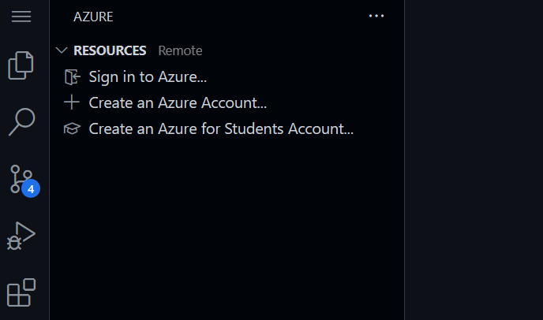
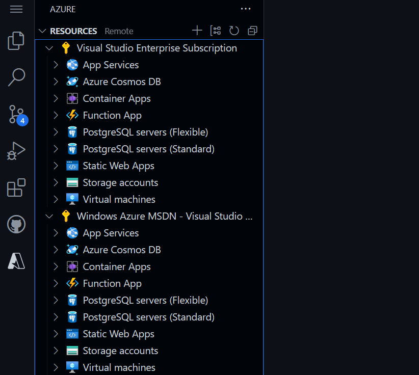
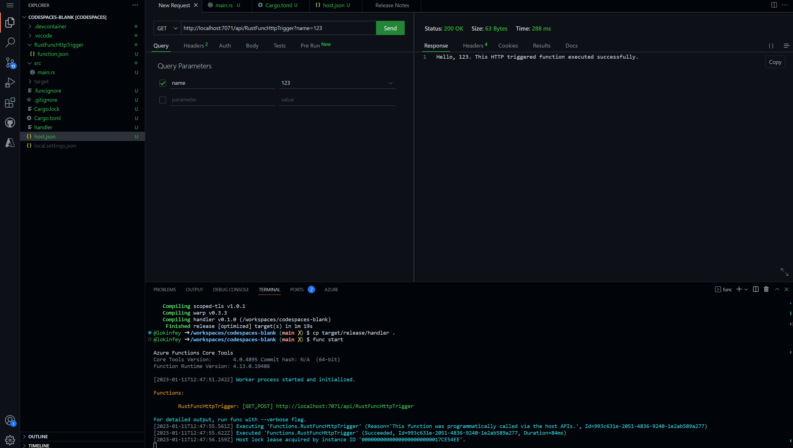

# **在 GitHub Codespaces 上学习 Rust**

在新一代编程语言上， Rust 是非常受欢迎的。通过 Rust 你可以更高效地写出更可靠的软件。Rust 可以应用在云原生，系统管理，以及 Web 3 ，物联网以及加密货币等领域。现在不少公司都把 Rust 作为 C/C++ 的一种安全替代语言。你可以通过 GitHub Codespaces 快速搭建你的 Rust 学习环境。

以下是三个场景

## **场景一：GitHub Codespaces 搭建 Rust 开发环境**

1. 通过空模版创建 GitHub Codespaces


2. 通过 CMD + Shift + P - macOS / Ctrl + Shift + P - Linux / Windows 创建 devcontainer.json 


   选择 Rust devcontainers


3. 添加你需要的一些功能，如 Azure CLI 等
   


4. Rebuild 你的 GitHub Codespaces
   


5. 你可以通过输入以下命令行查看 Rust 环境的设置

```bash

cargo --version

rustc --version

```


恭喜你，你已经完成了 GitHub Codespaces 上的 Rust 环境设置。


## **场景二：在 GitHub Codespaces 调试 Rust 应用**

我们延续使用场景一的环境，如果你没有完成场景一，请跳转到场景一，完成环境配置。

1. 在 GitHub Codespaces 上打开 Terminal 通过 cargo 创建一个 Rust 项目

```bash

cargo new rustdemoapp

```

2. 进入 rustdemoapp 文件夹 ， 输入如下命令，执行你人生中第一个 Rust 程序

```bash

cargo build

cargo run

```


3. 在 GitHub Codespaces 上打开 src/main.rs , 并设置断点


4. 选择 Debug 后进入 launch.json , 添加如下路径

```json

{
    // Use IntelliSense to learn about possible attributes.
    // Hover to view descriptions of existing attributes.
    // For more information, visit: https://go.microsoft.com/fwlink/?linkid=830387
    "version": "0.2.0",
    "configurations": [
        {
            "type": "lldb",
            "request": "launch",
            "name": "Debug",
            "program": "${workspaceFolder}/rustdemoapp/target/debug/rustdemoapp",
            "args": [],
            "cwd": "${workspaceFolder}"
        }
    ]
}

```

5. 点击 Debug ， 就可以进入调试


## **场景三：在 GitHub Codespaces 用 Rust 开发 Azure Functions**

我们继续延续场景一，所搭建的 GitHub Codespaces 来完成相关的学习，如果你没有完成场景一的搭建，请回到场景一来完成相关的环境。

我们知道 Rust 可以完成云原生的相关操作，所以你可以通过 Rust 完成不同的云原生功能开发，这里介绍一下如何通过 Rust 完成 Azure Functions 的开发。

0. 删除场景二的文件夹 rustdemoapp

1. 设置 GitHub Codespaces 的环境，转换为 4 核 CPU , 8 GB 内存， 32 GB 存储


2. 在 GitHub Codespaces 添加与 Azure 相关的组件 ， 选择添加到 devcontainer.json 里面 ，并 Rebuild 开发环境 


3. 选择登录你的 Azure Portal



    登录成功后，如下




4. 在命令行安装与 Azure Functions SDK 相关的组件


```bash

curl https://packages.microsoft.com/keys/microsoft.asc | gpg --dearmor > microsoft.gpg

sudo mv microsoft.gpg /etc/apt/trusted.gpg.d/microsoft.gpg

sudo sh -c 'echo "deb [arch=amd64] https://packages.microsoft.com/debian/$(lsb_release -rs | cut -d'.' -f 1)/prod $(lsb_release -cs) main" > /etc/apt/sources.list.d/dotnetdev.list'

sudo apt-get update

sudo apt-get install azure-functions-core-tools-4

```


5. 在 GitHub Codespaces 上创建 Azure Function


依次选择 Custom Handler - HTTP trigger - RustFuncHttpTrigger - Anonymous - Add to workspace

创建成功后，如图


6. 在命令行，根目录下输入以下命令


```bash

cargo init --name handler


```

7. 修改 Cargo.toml


```

[dependencies]
warp = "0.3"
tokio = { version = "1", features = ["rt", "macros", "rt-multi-thread"] }


```

8. 修改 src/main.rs


```rust

use std::collections::HashMap;
use std::env;
use std::net::Ipv4Addr;
use warp::{http::Response, Filter};

#[tokio::main]
async fn main() {
    let example1 = warp::get()
        .and(warp::path("api"))
        .and(warp::path("RustFuncHttpTrigger"))
        .and(warp::query::<HashMap<String, String>>())
        .map(|p: HashMap<String, String>| match p.get("name") {
            Some(name) => Response::builder().body(format!("Hello, {}. This HTTP triggered function executed successfully.", name)),
            None => Response::builder().body(String::from("This HTTP triggered function executed successfully. Pass a name in the query string for a personalized response.")),
        });

    let port_key = "FUNCTIONS_CUSTOMHANDLER_PORT";
    let port: u16 = match env::var(port_key) {
        Ok(val) => val.parse().expect("Custom Handler port is not a number!"),
        Err(_) => 3000,
    };

    warp::serve(example1).run((Ipv4Addr::LOCALHOST, port)).await
}

```


9. 命令行执行


```bash


cargo build --release

cp target/release/handler .


```

10. 修改 host.json 中的 customHandler 字段


```json

"customHandler": {
  "description": {
    "defaultExecutablePath": "handler",
    "workingDirectory": "",
    "arguments": []
  },
  "enableForwardingHttpRequest": true
}

```

11. 在命令行输入 func start 即可启用 Azure Functions


建议安装 Thunder Client 来看运行结果





## **相关资源**


0. 注册你的 GitHub  https://github.com/signup 

1. 了解 GitHub Codespaces https://github.com/features/codespaces 

2. 学习 Rust 的相关知识 https://learn.microsoft.com/en-us/training/paths/rust-first-steps/

3. 学习用 Rust 构建 Azure Function https://learn.microsoft.com/en-us/azure/azure-functions/create-first-function-vs-code-other?tabs=rust%2Cmacos


