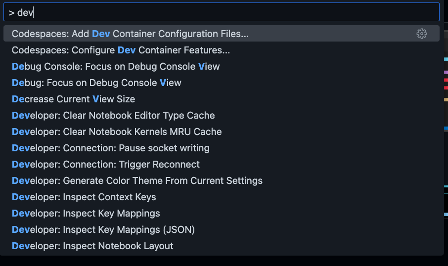
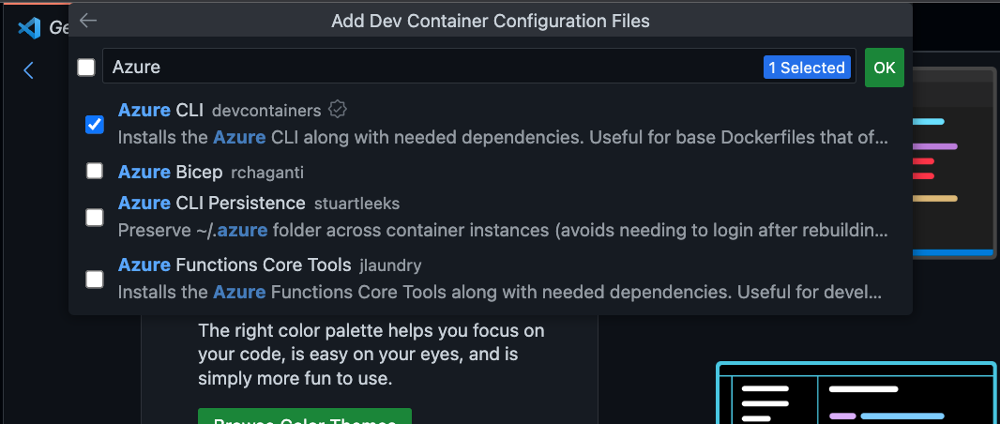
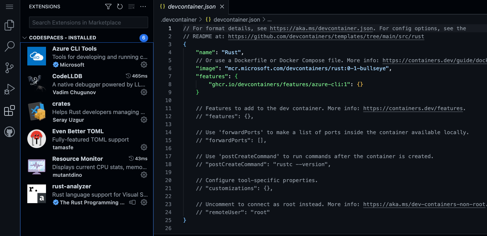

# **在 GitHub Codespaces 上学习 Rust**

在新一代编程语言上， Rust 是非常受欢迎的。通过 Rust 你可以更高效地写出更可靠的软件。Rust 可以应用在云原生，系统管理，以及 Web 3 ，物联网以及加密货币等领域。现在不少公司都把 Rust 作为 C/C++ 的一种安全替代语言。你可以通过 GitHub Codespaces 快速搭建你的 Rust 学习环境。

以下是三个场景

## **场景一：GitHub Codespaces 搭建 Rust 开发环境**

1. 通过空模版创建 GitHub Codespaces


2. 通过 CMD + Shift + P - macOS / Ctrl + Shift + P - Linux / Windows 创建 devcontainer.json 



   选择 Rust devcontainers


3. 添加你需要的一些功能，如 Azure CLI 等
   


4. Rebuild 你的 GitHub Codespaces
   


5. 你可以通过输入以下命令行查看 Rust 环境的设置

```bash

cargo --version

rustc --version

```


恭喜你，你已经完成了 GitHub Codespaces 上的 Rust 环境设置。



## **场景二：在 GitHub Codespaces 调试 Rust 应用**

我们延续使用场景一的环境，如果你没有完成场景一，请跳转到场景一，完成环境配置。

1. 在 GitHub Codespaces 上打开 Terminal 通过 cargo 创建一个 Rust 项目

```bash

cargo new rustdemoapp

```

2. 进入 rustdemoapp 文件夹 ， 输入如下命令，执行你人生中第一个 Rust 程序

```bash

cargo build

cargo run

```


3. 在 GitHub Codespaces 上打开 src/main.rs , 并设置断点


4. 选择 Debug 后进入 launch.json , 添加如下路径

```json

{
    // Use IntelliSense to learn about possible attributes.
    // Hover to view descriptions of existing attributes.
    // For more information, visit: https://go.microsoft.com/fwlink/?linkid=830387
    "version": "0.2.0",
    "configurations": [
        {
            "type": "lldb",
            "request": "launch",
            "name": "Debug",
            "program": "${workspaceFolder}/rustdemoapp/target/debug/rustdemoapp",
            "args": [],
            "cwd": "${workspaceFolder}"
        }
    ]
}

```

5. 点击 Debug ， 就可以进入调试


## **场景三：在 GitHub Codespaces 用 Rust 开发 Azure Functions**

请阅读 ：https://github.com/kinfey/AzureFunctionWasmDemo


## **相关资源**


0. 注册你的 GitHub  https://github.com/signup 

1. 了解 GitHub Codespaces https://github.com/features/codespaces 

2. 学习 Rust 的相关知识 https://learn.microsoft.com/en-us/training/paths/rust-first-steps/

3. 学习用 Rust 构建 Azure Function https://learn.microsoft.com/en-us/azure/azure-functions/create-first-function-vs-code-other?tabs=rust%2Cmacos


