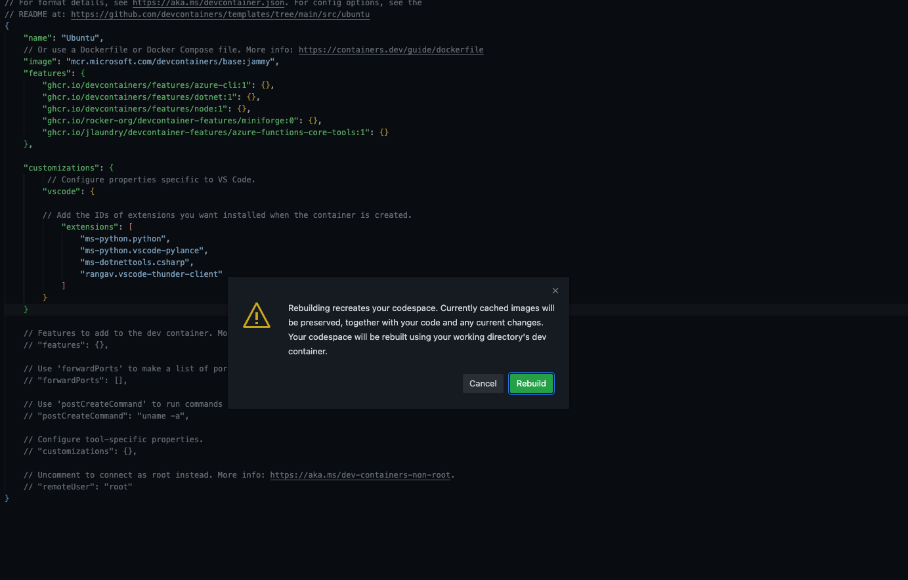

# **配置 GitHub Codespaces 上的云原生开发环境**

现阶段有非常多的云原生技术，通过 GitHub Codespaces 我们可以应对不同的云原生场景。如容器的开发，如 K8s 应用场景的配置以及维护，可以协助不同的项目上云。这对于开发团队有不同的挑战，首先环境的统一性，其次就是多场景多技术的整合。或者你可以把 GitHub Codespaces 看做成一个云端的在线 Visual Studio Code ，但他的功能至于 Visual Studio Code ，不仅兼容插件，还支持不同的云端场景以及模版。我们可以快速通过 GitHub Codespaces 构建云原生的开发环境。下面我们就通过简易的步骤构建一个云原生开发环境。


**1. 选择空模版构建一个 GitHub Codespaces 项目**


**2. 并把机器配置切换为 4核 CPU , 8GB 内存 , 32GB 存储**


**3. 为 GitHub Codespaces 搭配设置好环境**

macOS 使用 CMD + Shift + P , Windows / Linux 使用 Ctrl + Shift + P 选择 Codespaces 下的  Add Dev Container 选择 Ubuntu 22.04 开发容器 (对于云原生环境 Ubuntu 是最好的开发系统)


版本选择 jammy - 22.04 


**4. 添加不同的 SDK 和语言环境的支持**

Azure 相关的如 Azure CLI ， Azure Functions 等

Dotnet CLI , Miniforge , 以及 nodejs 等

选择成功后可以参考以下 devcontainer.json 的配置

```json

{
	"name": "Ubuntu",
	"image": "mcr.microsoft.com/devcontainers/base:jammy",
	"features": {
		"ghcr.io/devcontainers/features/azure-cli:1": {},
		"ghcr.io/devcontainers/features/dotnet:1": {},
		"ghcr.io/devcontainers/features/node:1": {},
		"ghcr.io/rocker-org/devcontainer-features/miniforge:0": {},
		"ghcr.io/jlaundry/devcontainer-features/azure-functions-core-tools:1": {}
	}


}

```


**5. 这里可以为环境添加一些 extensions 的插件**

在 devcontainer.json 增加下面的语句， 为你的云原生 GitHub Codespaces 环境添加 .NET , Python , Thunder-Client 等插件。


```json

	"customizations": {
         // Configure properties specific to VS Code.
		"vscode": {
		
		// Add the IDs of extensions you want installed when the container is created.
			"extensions": [
				"ms-python.python",
				"ms-python.vscode-pylance",
				"ms-dotnettools.csharp",
				"rangav.vscode-thunder-client"
			]
		}
    }


```

我们可以看看完整的 devcontainer.json 


```json

// For format details, see https://aka.ms/devcontainer.json. For config options, see the
// README at: https://github.com/devcontainers/templates/tree/main/src/ubuntu
{
	"name": "Ubuntu",
	// Or use a Dockerfile or Docker Compose file. More info: https://containers.dev/guide/dockerfile
	"image": "mcr.microsoft.com/devcontainers/base:jammy",
	"features": {
		"ghcr.io/devcontainers/features/azure-cli:1": {},
		"ghcr.io/devcontainers/features/dotnet:1": {},
		"ghcr.io/devcontainers/features/node:1": {},
		"ghcr.io/rocker-org/devcontainer-features/miniforge:0": {},
		"ghcr.io/jlaundry/devcontainer-features/azure-functions-core-tools:1": {}
	},
	"customizations": {
         // Configure properties specific to VS Code.
		"vscode": {
		
		// Add the IDs of extensions you want installed when the container is created.
			"extensions": [
				"ms-python.python",
				"ms-python.vscode-pylance",
				"ms-dotnettools.csharp",
				"rangav.vscode-thunder-client"
			]
		}
    }

	// Features to add to the dev container. More info: https://containers.dev/features.
	// "features": {},

	// Use 'forwardPorts' to make a list of ports inside the container available locally.
	// "forwardPorts": [],

	// Use 'postCreateCommand' to run commands after the container is created.
	// "postCreateCommand": "uname -a",

	// Configure tool-specific properties.
	// "customizations": {},

	// Uncomment to connect as root instead. More info: https://aka.ms/dev-containers-non-root.
	// "remoteUser": "root"
}


```

6. 完成后， Rebuild 你的 GitHub Codespaces




你的环境就配置好了，接下来我们尝试构建两个项目，为后面的联系打好基础

在终端创建一个文件夹 apps ， 并在 apps 下构建一个 backend.app 和 frontend.app 的子文件夹


## **项目一： 构建一个 .NET Blazor Web Assbembly 应用**

1. 通过终端进入刚才建立好的 frontend.app 文件夹


```bash

cd apps
cd frontend.app

```

2. 在 frontend.app 下输入以下命令构建一个 .NET Blazor Wasm 应用


```bash

dotnet new blazorwasm -o BlazorUI.App

cd BlazorUI.App

dotnet restore

dotnet build

dotnet run

```

3. 在浏览器可以直接打开 Blazor Wasm 的应用


## **项目二： 构建一个 Python 写的 Azure Functions**


1. 进入终端， 安装配置好你的 Python


```bash

conda create -n pydev python=3.9.10

conda activate pydev


```

2. macOS 使用 CMD + Shift + P , Windows / Linux 使用 Ctrl + Shift + P 选择 Azure Functions 下的  Create Function ,  选择好之前构建的 backend.app 文件夹， 选择 HttpTrigger 和匿名访问 ，并命名为 AIOnnxHttpTrigger 

3. 把 https://github.com/kinfey/PythonOnnxDemo/tree/codespace-kinfey-bug-free-space-winner-gwjxj67qvv6fvr6/OnnxHttpTriggerDemo 内的文件替换为 AIOnnxHttpTrigger 文件下的文件


4. 在命令行通过 func start 启动你的 Azure Functions


```bash

func start

```

5. 通过 Thunder Client 验证一下


这样大家就完成了本次 GitHub Codespaces 的云原生环境配置了，如果大家希望了解更多请进入下一章节


## **相关资源**


0. 注册你的 GitHub  https://github.com/signup 

1. 了解 GitHub Codespaces https://github.com/features/codespaces 

2. 学习 .NET Blazor 的相关知识 https://dotnet.microsoft.com/en-us/apps/aspnet/web-apps/blazor

3. 学习 Azure Functions 的相关知识 https://learn.microsoft.com/en-us/azure/azure-functions/functions-overview


