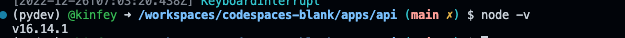

## **通过 GitHub Codespaces 打造一个 Azure Static Web App 和 Azure Function 结合的应用**


Azure Static Web Apps 是一种服务，可从代码存储库自动生成完整的堆栈 Web 应用，并将其部署到 Azure。


Azure 静态 Web 应用的工作流适用于开发人员的日常工作流。 基于代码更改生成并部署应用。

当你创建 Azure Static Web Apps 资源时，Azure 会直接与 GitHub 或 Azure DevOps 交互以监视你选择的分支。 每次你向受监视的分支推送提交或接受拉取请求时，系统都会自动运行一次生成，并将你的应用和 API 部署到 Azure。

通常使用不需要服务器端渲染的库和 Web 框架（例如 Angular、React、Svelte、Vue 或 Blazor）来生成静态 Web 应用。 这些应用包括构成应用程序的 HTML、CSS、JavaScript 和映像资产。 对于传统 Web 服务器，这些资产与任何所需的 API 终结点一起由单个服务器提供。

使用静态 Web 应用时，静态资产与传统 Web 服务器分离，由分布在世界各地的服务器端提供。 由于文件在物理上离最终用户更近，这种分布使文件提供的速度更快。 此外，API 终结点使用无服务器体系结构，无需将完整的后端服务器组合在一起。

**主要功能**

适用于 HTML、CSS、JavaScript 和映像等静态内容的 Web 托管。

Azure Functions 提供的集成 API 支持，可选择使用标准帐户链接现有的 Azure Functions 应用程序。

一流的 GitHub 和 Azure DevOps 集成，其中的存储库更改会触发生成和部署。

全球分布的静态内容，使内容更接近你的用户。

可自动续订的免费 SSL 证书。

自定义域为应用提供品牌自定义。

调用 API 时使用反向代理的无缝安全模型，这不需要配置 CORS。

身份验证提供程序与 Azure Active Directory、GitHub 和 Twitter 集成。

可自定义的授权角色定义和分配。

后端路由规则，使你能够完全控制所提供的内容和路由。

生成的临时版本由拉取请求提供支持，在发布前提供站点的预览版本。

CLI 支持通过 Azure CLI 创建云资源，并通过 Azure 静态 Web 应用程序 CLI 进行本地开发。


本次的练习会结合之前设置好的环境和任务来完成以下两个任务，如果你还没有完成，请跳去改章节进行配置 https://github.com/kinfey/GitHubCodeSpaceWorkShop/blob/main/02.CloudNativeEnv.md 


### **任务一： 配置好你的 swa cli**

1. 我们在之前已经配置好了对应的环境配置，但我们需要确认我们的 nodejs 在 16.x 的版本，因为我们选择了 nvm 包进行管理，所以这里我们可以通过 nvm 对 nodejs 版本进行调整, 通过终端输入

```bash

nvm install v16.14.0

```

通过 node -v 验证一下是否已经正确



这个时候你可以通过你的 terminal 进行验证


2. 安装好你的 swa cli


```bash


npm install -g @azure/static-web-apps-cli


```

可以通过 swa -v 验证版本号，这样就完成了 swa cli 的配置 


### **任务二： 修改之前的项目**

Blazor wasm 项目中替换 Pages/Index.razor

```csharp

@page "/"
@using System.Web
@inject HttpClient _httpClient;

<PageTitle>Index</PageTitle>


<EditForm Model="@formModel" OnValidSubmit="SubmitForm">

    <input placeholder="Enter your picture URL" style="width:80%" @bind-value="@formModel.URL"   />

    <input style="width:40%" type="submit" value="Submit" />

</EditForm>

<p>Result : @responseText</p>


@code {


    private FormModel formModel { get; set; } = new FormModel();

    private string responseText { get; set; } = "";


    private class FormModel
    {
        public string? URL { get; set; }
    }

    private async Task SubmitForm()
    {
        await GetAIResponseAsync();
    }

    private async Task GetAIResponseAsync()
    {
        if(_httpClient.BaseAddress is not null)
        {
            var uriBuilder = new UriBuilder(_httpClient.BaseAddress);
            uriBuilder.Path = "/api/AIOnnxHttpTrigger";

            if(!string.IsNullOrEmpty(formModel.URL) && !string.IsNullOrWhiteSpace(formModel.URL))
            {
                var query = HttpUtility.ParseQueryString(uriBuilder.Query);

                query["img"] = formModel.URL;

                uriBuilder.Query = query.ToString();
            }

            var builtUri = uriBuilder.ToString();

            Console.WriteLine($"builtUri: {builtUri}");

            @* responseText = uriBuilder.ToString(); *@

            var response = await _httpClient.GetStringAsync(builtUri);

            responseText = response;
        }
    }
}

```

2. 并在 apps 文件夹中添加 package.json, 包括以下内容


```json

{
  "name": "swa-blazorandfunc-demo",
  "version": "1.0.0",
  "scripts": {
    "start": "swa start http://localhost:5074 --api-location http://localhost:7071"
  },
  "keywords": [],
  "author": "",
  "license": "ISC",
  "main": "index.js",
  "description": ""
}


```

3. 在终端环境，添加三个不同的终端

在其中一个终端运行 Blazor wasm 的项目, 一个终端运行 Azure Functions 的项目， 确保他们长期运行


4. 在最后一个终端，在 apps 文件夹下运行

```bash

npm start

```


5. 在浏览器中打开就可以看到，把地址复制，这里是我的，各位会有不一样 


https://kinfey-turbo-yodel-wjpvpxg7xr7h9wr7-4280.preview.app.github.dev/

并替换到 Blazor wasm Program.cs 的这句话中

```bash

builder.Services.AddScoped(sp => new HttpClient { BaseAddress = new Uri("https://kinfey-turbo-yodel-wjpvpxg7xr7h9wr7-4280.preview.app.github.dev/") });

```

6. 再次运行，输入地址即可获取结果


当然你可以快速部署到 Azure ，这里就不一一展示了。


## **相关资源**


0. 注册你的 GitHub  https://github.com/signup 

1. 了解 GitHub Codespaces https://github.com/features/codespaces 

2. 学习 Static Web App  的相关知识 https://learn.microsoft.com/en-us/azure/static-web-apps/overview


