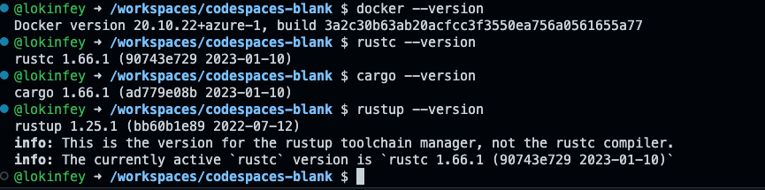

# **用 Rust 开发 WasmEdge 应用**

在云原生开发领域里面有非常多不同的技术和概念， WebAssbembly 就是其中之一。

## **什么是 WebAssembly**

WebAssembly 是一种运行在现代网络浏览器中的新型代码，并且提供新的性能特性和效果。它设计的目的不是为了手写代码而是为诸如 C、C++和 Rust 等低级源语言提供一个高效的编译目标。

对于网络平台而言，这具有巨大的意义——这为客户端 app 提供了一种在网络平台以接近本地速度的方式运行多种语言编写的代码的方式；在这之前，客户端 app 是不可能做到的。

通过 Rust 可以写 Web Assbemly 的应用，本系列我们会结合 GitHub Codespaces 用 Rust 编写 WasmEdge 应用。


## **什么是 WasmEdge**

WasmEdge 是一种轻量级、高性能且可扩展的 WebAssembly 运行时，适用于云原生、边缘计算和去中心化应用程序。 它为无服务器应用程序、嵌入式功能、微服务、智能合约和物联网设备提供支持。 WasmEdge 目前是一个 CNCF（云原生计算基金会）沙盒项目。

WasmEdge Runtime 为其包含的 WebAssembly 字节码程序提供了一个定义良好的执行沙箱。 运行时为操作系统资源（例如，文件系统、套接字、环境变量、进程）和内存空间提供隔离和保护。

接下来我们通过 GitHub Codespaces 一起来学习通过 Rust 开发 WasmEdge 应用，如果你希望先了解 Rust ，可以跳转到 <a href="./01.LearnRust.md">通过 GitHub Codespaces 学习 Rust</a> 的相关内容


### **场景一：WasmEdge 环境搭建**

关于 WasmEdge 的环境搭建，我们需要更强大的支撑，和之前的步骤不同，我们这里依赖于 GitHub Codespaces 的 Ubuntu devcontainer。

1. 选择 GitHub Codespaces 的空模版进行创建


2. 通过 CMD + Shift + P - macOS 或 Ctrl + Shit + P - Windows / Linux ， 添加 devcontainer 


选择 Ubuntu 的 devcontainer


并选择 22.04 jammy 的版本


3. 选择相关的 devcontainer 组件，这里按照需要添加 Rust ， Azure CLI ， Docker 等


4. 为 devcontainers.json 添加 Rust 开发 ，Azure 开发以及 Docker 开发对应的插件。Rust 开发就包括 rust-analyzer ，crates ， CodeLLDB / Azure 开发就包括 Azure Tools / Docker 相关的 Docker 组件 / 还有网络开发用到的 Thunder Client

结合步骤 3 ，4 完整的 devcontainer.json 如下 ：

```json

{
	"name": "Ubuntu",
	"image": "mcr.microsoft.com/devcontainers/base:jammy",
	"features": {
		"ghcr.io/devcontainers/features/azure-cli:1": {},
		"ghcr.io/devcontainers/features/docker-in-docker:2": {},
		"ghcr.io/devcontainers/features/rust:1": {}
	},
	"customizations": {
		"vscode": {
			"extensions": [
				"serayuzgur.crates",
				"vadimcn.vscode-lldb",
				"ms-vscode.vscode-node-azure-pack",
				"ms-azuretools.vscode-docker",
				"rust-lang.rust-analyzer",
				"rangav.vscode-thunder-client"
			]
		}
	}
}

```

 5. Rebuild devcontainer

 6. 关闭 codespaces ，修改设备设置 4 核 CPU ，8 GB 内存， 32 GB 硬盘


 7. 重新进入 devcontainer

 8. 可以输入以下指令查看环境是否安装成功

```bash

az --version
docker --version
rustc --version
cargo --version
rustup --version

```



 9. 在命令行安装 wasmedge sdk 

```bash

curl -sSf https://raw.githubusercontent.com/WasmEdge/WasmEdge/master/utils/install.sh | bash

source /home/vscode/.bashrc

```

10.  创建一个简单的 wasm 应用看看

在命令行输入以下命令


```bash


cd hellowasmedge

rustup target add wasm32-wasi

cargo build --target wasm32-wasi

wasmedge target/wasm32-wasi/debug/hellowasmedge.wasm

```

这个时候你可以正确运行一个简单的 wasmedge 应用


### **场景二：用 Wasmedge 调用 Tensorflow 模型**

备注 ：如果你没有搭建场景一的环境，请回到场景一完成相关练习。 

在场景一 我们安装了 WasmEdge SDK ， 在场景三我们使用源代码的方式编译 WasmEdge SDK 因为我们基于 Tensorflow Lite 所以需要添加对应的组件

1. 通过终端，执行以下指令，为环境编译作准备


```bash

sudo apt-get update
sudo apt-get install -y software-properties-common libboost-all-dev ninja-build
sudo apt-get install -y llvm-14-dev liblld-14-dev clang-14
sudo apt-get install -y gcc g++ cmake
sudo apt-get install -y libssl-dev pkg-config gh vim

```

2. 在根目录下创建 tools 目录

```bash

mkdir tools

cd tools

git clone https://github.com/WasmEdge/WasmEdge.git

mkdir -p build && cd build

cmake -DCMAKE_BUILD_TYPE=Release -DWASMEDGE_PLUGIN_WASI_NN_BACKEND="TensorflowLite" .. && make -j2

cmake --install .


```

3. 回到 tools 目录继续执行
   
```bash

curl -s -L -O --remote-name-all https://github.com/second-state/WasmEdge-tensorflow-deps/releases/download/0.11.2/WasmEdge-tensorflow-deps-TFLite-0.11.2-manylinux2014_x86_64.tar.gz

tar -zxf WasmEdge-tensorflow-deps-TFLite-0.11.2-manylinux2014_x86_64.tar.gz

rm -f WasmEdge-tensorflow-deps-TFLite-0.11.2-manylinux2014_x86_64.tar.gz

mv libtensorflowlite_c.so /usr/local/lib

```

4. 通过 vim 编辑 ～/.bashrc 添加如下语句

export LD_LIBRARY_PATH=/usr/local/lib:${LD_LIBRARY_PATH}
export WASMEDGE_PLUGIN_PATH=/usr/local/lib/wasmedge

5. clone 该地址 https://github.com/lokinfey/WasmEdgeGitHubSpaceDemo

6. 在命令行执行以下操作

```bash

cd tfdemo

cargo build --target=wasm32-wasi --release

wasmedgec target/wasm32-wasi/release/tfdemo.wasm tfdemo.wasm

```

7. 在终端执行测试相关结果

```bash

wasmedge --dir .:. tfdemo.wasm model.tflite test.png

```


### **场景三：Azure Function 上调用 Wasmedge**

请参考我的 AzureFunctionWasmDemo https://github.com/kinfey/AzureFunctionWasmDemo

恭喜你 ， 把 WasmEdge 三个场景完成了。


## **相关资源**


0. 注册你的 GitHub  https://github.com/signup 

1. 了解 GitHub Codespaces https://github.com/features/codespaces 

2. 学习 Rust 的相关知识 https://learn.microsoft.com/en-us/training/paths/rust-first-steps/

3. 学习用 Rust 构建 Azure Function https://learn.microsoft.com/en-us/azure/azure-functions/create-first-function-vs-code-other?tabs=rust%**2Cmacos**

4. 学习 Wasmedge https://wasmedge.org/book/en/

5. WasmEdge NNI 插件编译相关内容 https://wasmedge.org/book/en/contribute/build_from_src/plugin_wasi_nn.html#build-wasmedge-with-wasi-nn-tensorflow-lite-backend


