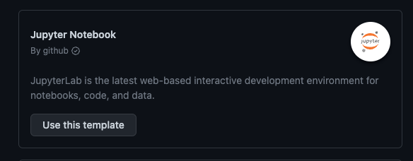
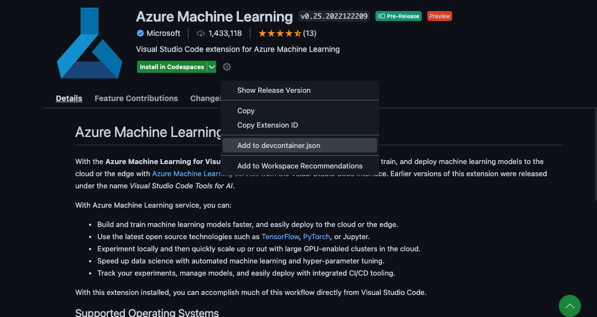

# **在 GitHub Codespaces 上构建机器学习环境**

在 GitHub Codespaces 上你可以根据基于已有模版或者根据自己的需要去构建机器学习环境。



当然这是一个不包含 GPU 的环境，如果你需要 GPU , 必须额外申请。这个已经包含的 Python ，和相关库。

或者我更喜欢自己够建环境，我更喜欢使用空模版构建自己的环境，例如 .NET 的机器学习，例如和 Azure 的库等，都是非常依赖我们的机器学习环境的。


自己搭建机器学习环境，需要的步骤如下：

**1. 选择 "Miniconda (Python 3)" 项目**


**2. 并把机器配置切换为 4核 CPU , 8GB 内存 , 32GB 存储**


**3. 添加不同的 SDK 和语言环境的支持**

Azure 相关的如 Azure CLI 


选择成功后可以参考以下 devcontainer.json 的配置

```json

{
	"name": "Miniconda (Python 3)",
	"build": { 
		"context": "..",
		"dockerfile": "Dockerfile"
	},
	"features": {
		"ghcr.io/devcontainers/features/azure-cli:1": {},
		"ghcr.io/devcontainers/features/node:1": {}
	}


}

```


**5. 把你需要的插件直接添加到容器**

Azure Machine Learning 插件，可以直接通过插件设置直接添加到 devcontainer.json





**6. 额外的环境配置**

你可以添加 Azure ML CLI v2 的扩展

通过 devcontainer.json 下增加执行脚本来完成相关的调用 

```json


	"onCreateCommand": "az extension add -n ml",

```

这是最后完成的 devcontainer.json

```json

// For format details, see https://aka.ms/devcontainer.json. For config options, see the
// README at: https://github.com/devcontainers/templates/tree/main/src/ubuntu
{
	"name": "Miniconda (Python 3)",
	"build": { 
		"context": "..",
		"dockerfile": "Dockerfile"
	},
	"features": {
		"ghcr.io/devcontainers/features/azure-cli:1": {},
		"ghcr.io/devcontainers/features/node:1": {}
	},
	"onCreateCommand": "az extension add -n ml",
	"customizations": {
		"vscode": {
			"extensions": [
				"ms-toolsai.vscode-ai"
			]
		}
	}
}

```


**6. 重新构建即可**

## **关于机器学习的环境配置搭配**


1. Python 你可以通过 miniforge 完成不同版本的 conda 安装

```

conda create -n pydev python=3.8.10

```

2. Python 相关库 

```bash

pip3 install numpy scipy scikit-learn matplotlib pandas pillow jupyterlab jupyter

```

3. 机器学习/深度学习框架 


```bash

pip3 install tensorflow

pip3 install torch torchvision torchaudio --extra-index-url https://download.pytorch.org/whl/cpu

```

4. 通过 GitHub Copilot 完成一个深度学习


## **相关资源**


0. 注册你的 GitHub  https://github.com/signup 

1. 了解 GitHub Codespaces https://github.com/features/codespaces 

2. 学习 Tensorflow https://learn.microsoft.com/en-us/training/paths/tensorflow-fundamentals/

3. 学习 PyTorch https://learn.microsoft.com/en-us/training/paths/pytorch-fundamentals/


