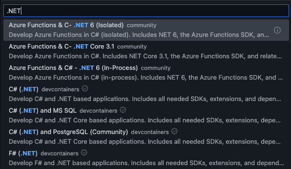
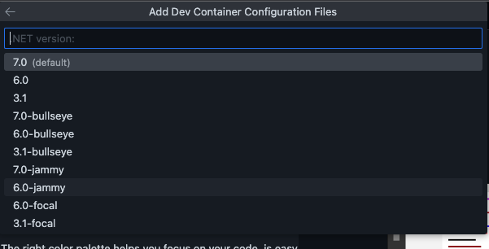
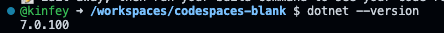
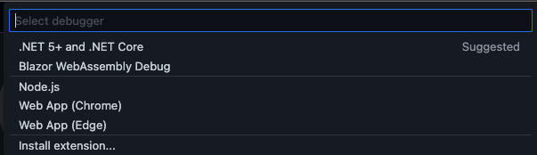
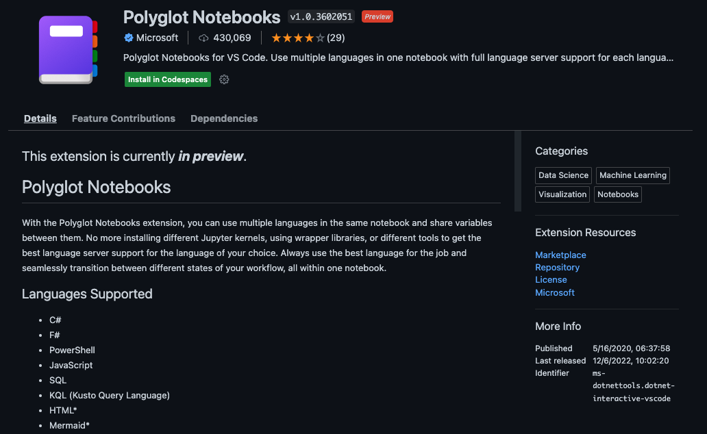
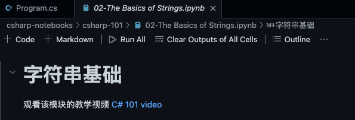
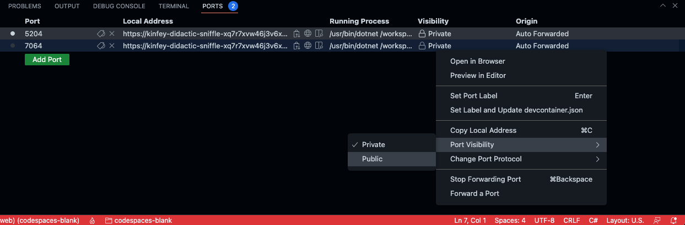
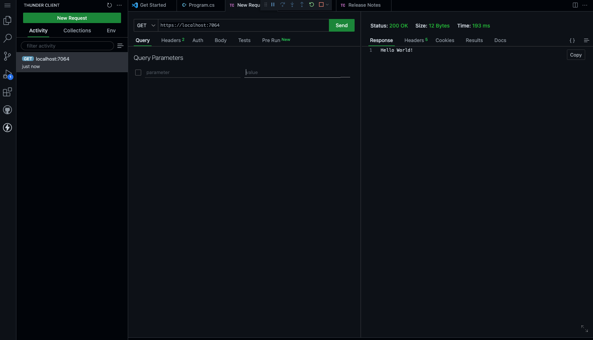

# **Learn C# on GitHub Codespaces**

After .NET was open sourced in 2016, it has become a cross-application scenario and cross-platform technology. You can write web pages, desktop applications, games, Internet of Things, mobile applications, cloud computing, big data and other applications through C#. We can learn about .NET through GitHub Codespaces. In this exercise, we use GitHub Codespaces to build a simple console, user, and cloud computing application.

## **Scenario 1: Building a console application**

1. Select an empty template on GitHub Codespaces to build a GitHub Codespaces template

<div style="text-align:center">
 
</div>

2. If you are a Windows / Linux user, please use Ctrl + Shift + P , if you are a macOS user, please use Cmd + Shift + P, select Codespaces: Configure Dev Container Features...

<div style="text-align:center">
 
</div>

3. Select C# (.NET) devcontainer

<div style="text-align:center">
 
</div>

4. Select .NET 7

<div style="text-align:center">
 
</div>

5. After the setup is successful, select Rebuild

6. On the opened GitHub Codespaces, open the console and enter the following command to view the relevant information of the .NET SDK

```bash

dotnet --version

```

<div style="text-align:center">
 
</div>

7. In the terminal, enter the following command to create a minimal .NET console command

```bash

dotnet new console -o HelloWorldApp

```

8. Select Run and Debug on GitHub Codespaces, select .NET 5+ and .NET Core, and run directly

<div style="text-align:center">
 
</div>

9. End Debug, you can set a breakpoint and run it again

<div style="text-align:center">
 
</div>

That's your first .NET application built in GitHub Codespaces, and you can move on to the next scenario.

## **Scenario 2: Learning C# in GitHub Codespaces**

As beginners, we need to learn the grammar of C#. For traditional grammar learning, we need IDE, but now we can learn C# programming through Notebook

0. Create a GitHub Codespaces and create a .NET 6 development environment through an empty template

1. Find Polyglot Notebooks in Extension of GitHub Codespaces and install

<div style="text-align:center">
 
</div>


2. Open the terminal of GitHub Codespaces and enter the following command

```bash

git clone https://github.com/kinfey/csharp-notebooks.git

```

3. Select the subdirectory csharp-101 under the directory csharp-notebooks

<div style="text-align:center">
 
</div>

4. Select 02-The Basics of Strings.ipynb, select the Run All button

<div style="text-align:center">
 
</div>

You can now learn the C# programming language interactively, much more concisely than in the past when you needed to configure an IDE. Hope to combine CSharp 101 to open your way of C# programming.

## **Scenario 3: Build a GitHub Codespaces environment with Minimal API**

If you finish learning the C# programming language and you want to do some microservice work, you can build Minmal API through .NET.

1. Create a GitHub Codespaces and create a .NET 7 development environment through an empty template

2. Build a Minimal API via the command line

```bash

dotnet new web -o DemoAPI

```
3. Run directly through Debug

4. Here you need to set the Port to Public


<div style="text-align:center">
 
</div>

5. You can also install the Thunder Client plug-in and directly access it with localhost

<div style="text-align:center">
 
</div>

## **Related Resources**

1. Learn about GitHub Codespaces https://github.com/features/codespaces
   
2. Learn C# https://learn.microsoft.com/zh-cn/dotnet/csharp/programming-guide/
   
3. C# 101 Study Manual https://github.com/kinfey/csharp-notebooks
   
4. Learn .NET Minimal API https://learn.microsoft.com/en-us/aspnet/core/tutorials/min-web-api?view=aspnetcore-7.0&tabs=visual-studio


