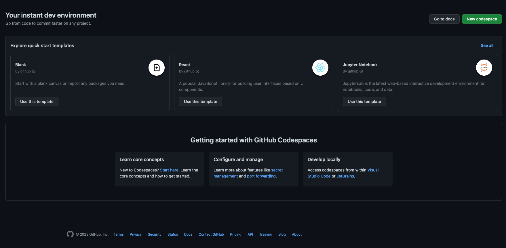
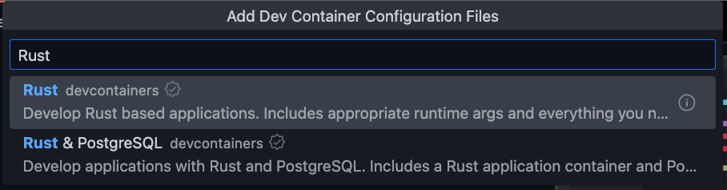
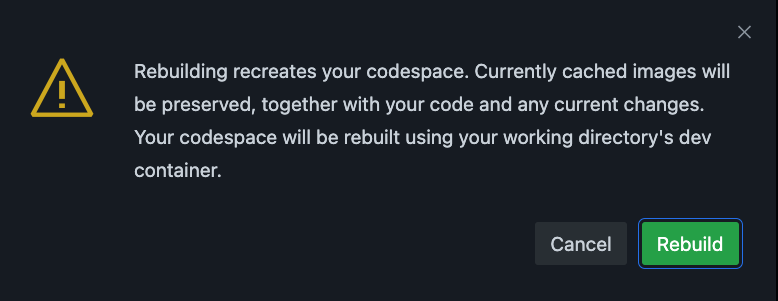
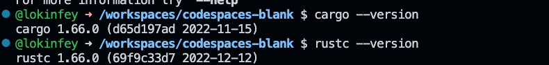
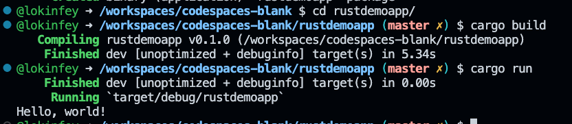
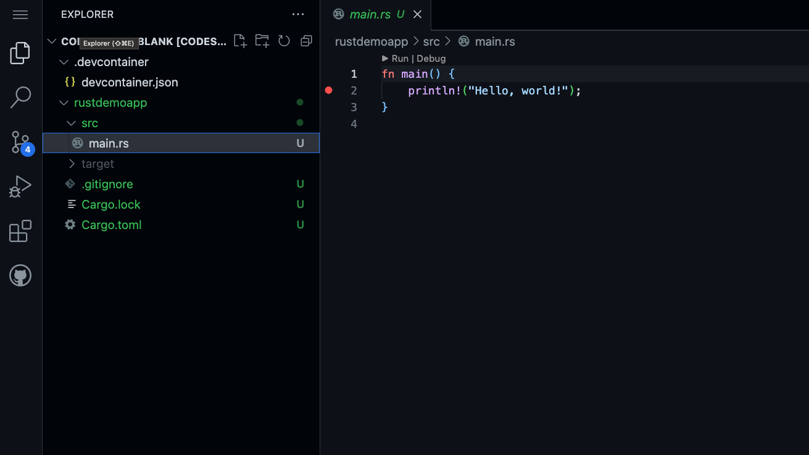
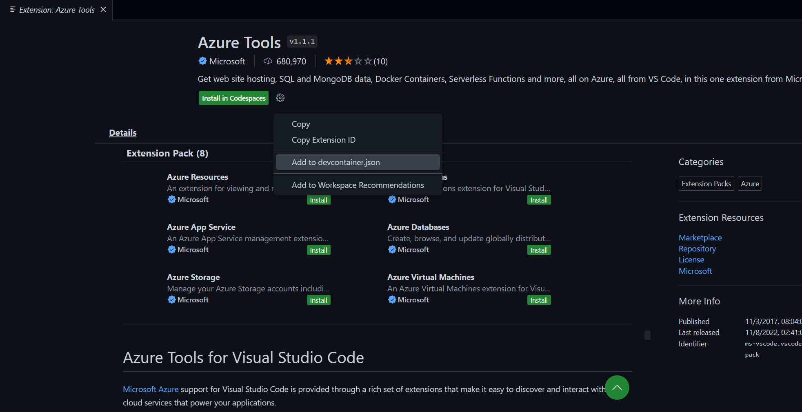
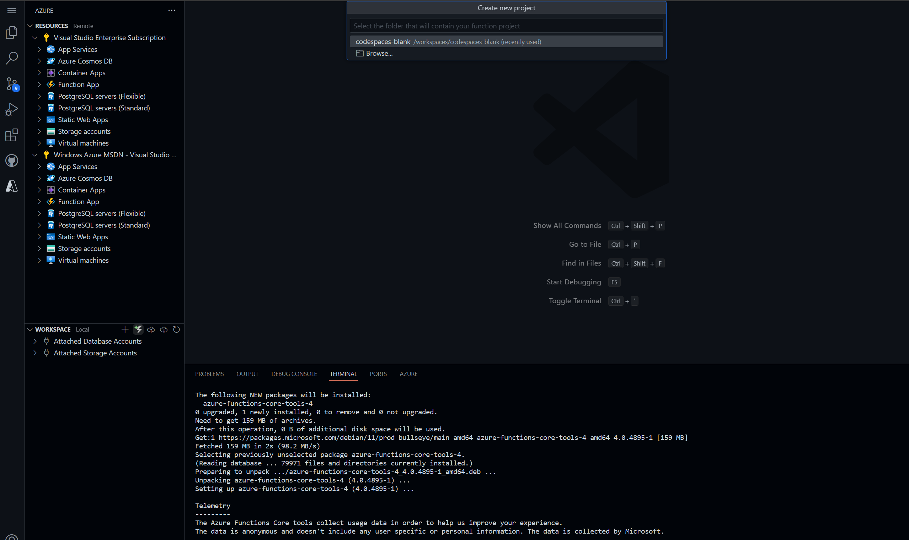
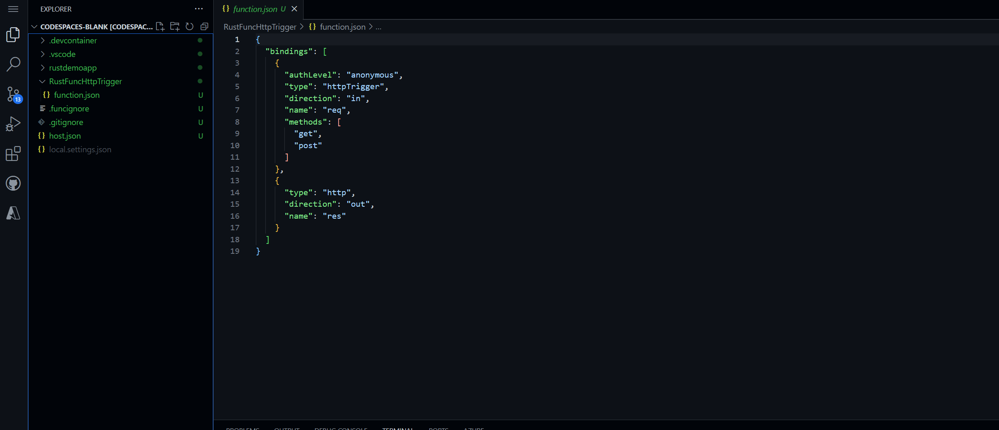
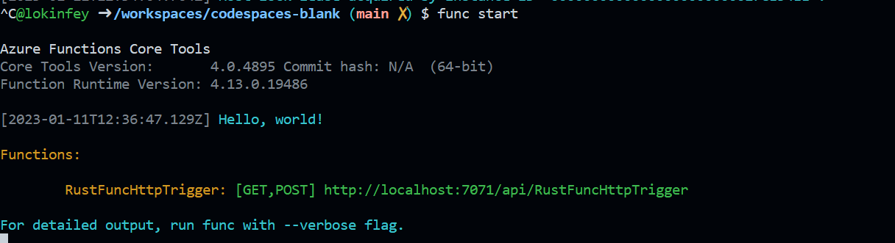

# **Learn Rust on GitHub Codespaces**

Rust is very popular among new generation programming languages. With Rust you can write more reliable software more efficiently. Rust can be applied in cloud native, system management, and Web 3, Internet of Things, and cryptocurrency. Many companies are now using Rust as a safe alternative to C/C++. You can quickly set up your Rust learning environment through GitHub Codespaces.

These are samples

## **Sample 1 ：Using GitHub Codespaces to create Rust dev environment**

1. Create Codespaces from an blank template



2. Create devcontainer.json via CMD + Shift + P - macOS  or  Ctrl + Shift + P - Linux / Windows


   Select Rust devcontainers



3. Add some features you need, such as Azure CLI, etc.
   


4. Rebuild your GitHub Codespaces
   


5. You can view the settings of your Rust environment in ternminal

```bash

cargo --version

rustc --version

```



Congratulations, you've finished setting up your Rust environment on GitHub Codespaces.


## **Sample 2：Using GitHub Codespaces to debug Rust application**

We continue to use the environment of Sample 1. If you have not completed Sample 1, please jump to Scenario 1 to complete the environment configuration.

1. Open Terminal on GitHub Codespaces and create a Rust project with cargo

```bash

cargo new rustdemoapp

```

1. Enter the rustdemoapp folder and enter the following command to execute the  Rust program 

```bash

cargo build

cargo run

```




3. Open src/main.rs on GitHub Codespaces and set a breakpoint




4. After selecting Debug, enter launch.json and add the following path

```json

{
    // Use IntelliSense to learn about possible attributes.
    // Hover to view descriptions of existing attributes.
    // For more information, visit: https://go.microsoft.com/fwlink/?linkid=830387
    "version": "0.2.0",
    "configurations": [
        {
            "type": "lldb",
            "request": "launch",
            "name": "Debug",
            "program": "${workspaceFolder}/rustdemoapp/target/debug/rustdemoapp",
            "args": [],
            "cwd": "${workspaceFolder}"
        }
    ]
}

```

5. Click Debug


## **Sample 3 ：Developing Azure Functions in Rust on GitHub Codespaces**

Let’s continue Sample 1 and build GitHub Codespaces to complete the relevant learning. If you have not completed the construction of Sample 1, please return to Sample 1 to complete the relevant environment.

0. Delete Sample 2 folder  rustdemoapp

1. Setting up the environment for GitHub Codespaces, converted to 4-core CPU, 8 GB RAM, 32 GB storage
   


2. Add Azure-related components in GitHub Codespaces, choose to add them to devcontainer.json, and rebuild the development environment 



3. Log in your Azure Portal


    After successful login, as follows


4. Install Azure Functions SDK-related components in terminal

```bash

curl https://packages.microsoft.com/keys/microsoft.asc | gpg --dearmor > microsoft.gpg

sudo mv microsoft.gpg /etc/apt/trusted.gpg.d/microsoft.gpg

sudo sh -c 'echo "deb [arch=amd64] https://packages.microsoft.com/debian/$(lsb_release -rs | cut -d'.' -f 1)/prod $(lsb_release -cs) main" > /etc/apt/sources.list.d/dotnetdev.list'

sudo apt-get update

sudo apt-get install azure-functions-core-tools-4

```


5. Create an Azure Function on GitHub Codespaces





Select Custom Handler - HTTP trigger - RustFuncHttpTrigger - Anonymous - Add to workspace

After successful , as shown in the figure



6. In terminal , enter the following command in the root folder


```bash

cargo init --name handler


```

7. Update your Cargo.toml


```

[dependencies]
warp = "0.3"
tokio = { version = "1", features = ["rt", "macros", "rt-multi-thread"] }


```

8. add these content in src/main.rs


```rust

use std::collections::HashMap;
use std::env;
use std::net::Ipv4Addr;
use warp::{http::Response, Filter};

#[tokio::main]
async fn main() {
    let example1 = warp::get()
        .and(warp::path("api"))
        .and(warp::path("RustFuncHttpTrigger"))
        .and(warp::query::<HashMap<String, String>>())
        .map(|p: HashMap<String, String>| match p.get("name") {
            Some(name) => Response::builder().body(format!("Hello, {}. This HTTP triggered function executed successfully.", name)),
            None => Response::builder().body(String::from("This HTTP triggered function executed successfully. Pass a name in the query string for a personalized response.")),
        });

    let port_key = "FUNCTIONS_CUSTOMHANDLER_PORT";
    let port: u16 = match env::var(port_key) {
        Ok(val) => val.parse().expect("Custom Handler port is not a number!"),
        Err(_) => 3000,
    };

    warp::serve(example1).run((Ipv4Addr::LOCALHOST, port)).await
}

```


9. run these in terminal


```bash


cargo build --release

cp target/release/handler .


```

10. Modify the customHandler field in host.json


```json

"customHandler": {
  "description": {
    "defaultExecutablePath": "handler",
    "workingDirectory": "",
    "arguments": []
  },
  "enableForwardingHttpRequest": true
}

```

11. Enter func start in terminal to run Azure Functions




It is recommended to install Thunder Client to see the running results


## **Resources**


0. Sign up your GitHub https://github.com/signup

1. Learn about GitHub Codespaces https://github.com/features/codespaces

2. Learn about Rust https://learn.microsoft.com/en-us/training/paths/rust-first-steps/

3. Learn to build Azure Functions with Rust https://learn.microsoft.com/en-us/azure/azure-functions/create-first-function-vs-code-other?tabs=rust%2Cmacos


