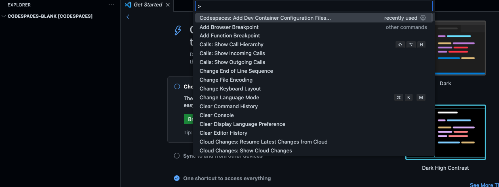
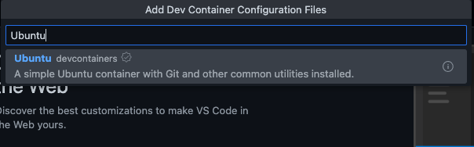
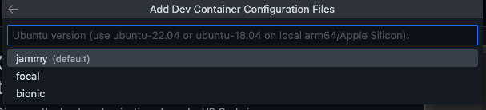
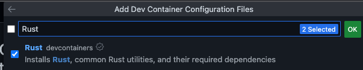
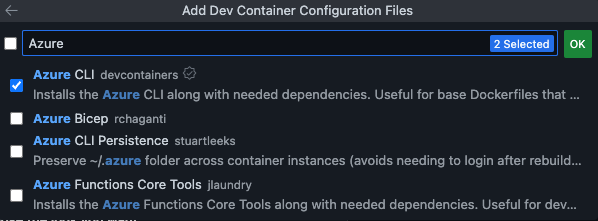
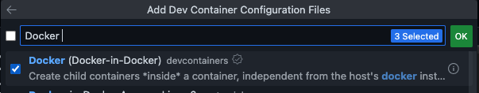
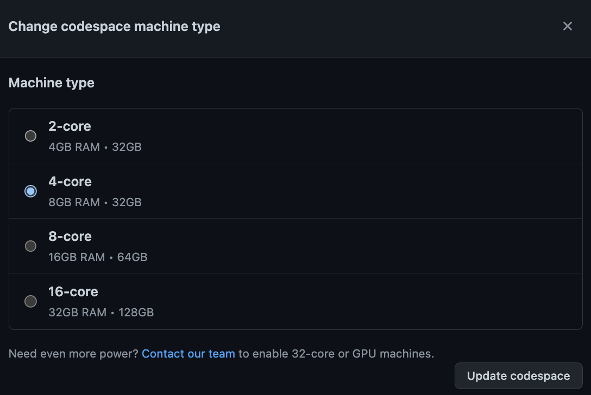
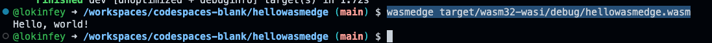
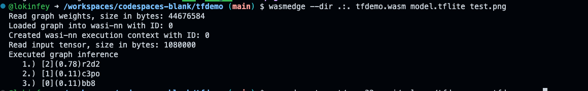

# **Develop a WasmEdge application with Rust**

There are many different technologies and concepts in the field of cloud native development, and WebAssbembly is one of them.

## **What is WebAssembly**

WebAssembly is a new type of code that runs in modern web browsers and offers new performance features and effects. It is not designed for hand-written code but to provide an efficient compilation target for low-level source languages such as C, C++, and Rust.

For web platforms, this has huge implications - it provides a way for client apps to run code written in multiple languages on the web at near-native speed; possible.

Rust can be used to write Web Assbemly applications. In this series, we will use Rust to write WasmEdge applications in combination with GitHub Codespaces.


## **What is  WasmEdge**

WasmEdge is a lightweight, high-performance, and scalable WebAssembly runtime for cloud-native, edge computing, and decentralized applications. It powers serverless applications, embedded functions, microservices, smart contracts, and IoT devices. WasmEdge is currently a CNCF (Cloud Native Computing Foundation) sandbox project.

The WasmEdge Runtime provides a well-defined execution sandbox for the WebAssembly bytecode programs it contains. The runtime provides isolation and protection for operating system resources (eg, file systems, sockets, environment variables, processes) and memory spaces.

Next, let's learn how to develop WasmEdge applications through Rust through GitHub Codespaces. If you want to know Rust first, you can jump to <a href="./01.LearnRust.md">Learn Rust in GitHub Codespaces</a> related information


### **Sample 1：WasmEdge environment**

Regarding the environment construction of WasmEdge, we need stronger support. Unlike the previous steps, we rely on the Ubuntu devcontainer of GitHub Codespaces here.

1. Select the blank template of GitHub Codespaces to create


2. Add devcontainer via CMD + Shift + P - macOS or Ctrl + Shit + P - Windows/Linux



Choose Ubuntu's devcontainer



and select Ubuntu 22.04 jammy



1. Select the relevant devcontainer components, add Rust, Azure CLI, Docker, etc. as required







4. Add the corresponding extensions for Rust development, Azure development and Docker development to devcontainers.json. Rust development includes rust-analyzer, crates, CodeLLDB / Azure development includes Azure Tools / Docker related Docker components / Thunder Client for network development

the complete devcontainer.json is as follows:

```json

{
	"name": "Ubuntu",
	"image": "mcr.microsoft.com/devcontainers/base:jammy",
	"features": {
		"ghcr.io/devcontainers/features/azure-cli:1": {},
		"ghcr.io/devcontainers/features/docker-in-docker:2": {},
		"ghcr.io/devcontainers/features/rust:1": {}
	},
	"customizations": {
		"vscode": {
			"extensions": [
				"serayuzgur.crates",
				"vadimcn.vscode-lldb",
				"ms-vscode.vscode-node-azure-pack",
				"ms-azuretools.vscode-docker",
				"rust-lang.rust-analyzer",
				"rangav.vscode-thunder-client"
			]
		}
	}
}

```

 5. Rebuild devcontainer

 6. Close codespaces, change machine type - 4-core CPU, 8 GB memory, 32 GB hard disk



 7. Go to your codepspaces

 8. You can enter the following command to check whether the environment is installed successfully

```bash

az --version
docker --version
rustc --version
cargo --version
rustup --version

```


 9. Install wasmedge sdk in terminal


```bash

curl -sSf https://raw.githubusercontent.com/WasmEdge/WasmEdge/master/utils/install.sh | bash

source /home/vscode/.bashrc

```

10.  Create a simple wasm application and see

input these commands in terminal


```bash


cd hellowasmedge

rustup target add wasm32-wasi

cargo build --target wasm32-wasi

wasmedge target/wasm32-wasi/debug/hellowasmedge.wasm

```

run your wasmedge application




### **Sample 2: Using Tensorflow lite model with Wasmedge**

Remarks: If you haven't built the environment of Sample 1, please go back to Sample 1 to complete the relevant exercises.

In Sample 1, we installed WasmEdge SDK, and in Sample2, we compiled WasmEdge SDK using source code because we are based on Tensorflow Lite, so we need to add corresponding components

1. Through the terminal, execute the following commands to prepare for environment compilation


```bash

sudo apt-get update
sudo apt-get install -y software-properties-common libboost-all-dev ninja-build
sudo apt-get install -y llvm-14-dev liblld-14-dev clang-14
sudo apt-get install -y gcc g++ cmake
sudo apt-get install -y libssl-dev pkg-config gh vim

```

2. Create a tools directory in the root directory

```bash

mkdir tools

cd tools

git clone https://github.com/WasmEdge/WasmEdge.git

mkdir -p build && cd build

cmake -DCMAKE_BUILD_TYPE=Release -DWASMEDGE_PLUGIN_WASI_NN_BACKEND="TensorflowLite" .. && make -j2

cmake --install .


```

3. Go back to the tools directory and continue executing
   
```bash

curl -s -L -O --remote-name-all https://github.com/second-state/WasmEdge-tensorflow-deps/releases/download/0.11.2/WasmEdge-tensorflow-deps-TFLite-0.11.2-manylinux2014_x86_64.tar.gz

tar -zxf WasmEdge-tensorflow-deps-TFLite-0.11.2-manylinux2014_x86_64.tar.gz

rm -f WasmEdge-tensorflow-deps-TFLite-0.11.2-manylinux2014_x86_64.tar.gz

mv libtensorflowlite_c.so /usr/local/lib

```

4. Edit ~/.bashrc through vim and add the following command line

export LD_LIBRARY_PATH=/usr/local/lib:${LD_LIBRARY_PATH}
export WASMEDGE_PLUGIN_PATH=/usr/local/lib/wasmedge

5. clone  https://github.com/lokinfey/WasmEdgeGitHubSpaceDemo

6. Run

```bash

cd tfdemo

cargo build --target=wasm32-wasi --release

wasmedgec target/wasm32-wasi/release/tfdemo.wasm tfdemo.wasm

```

1. Execute the test results in the terminal

```bash

wasmedge --dir .:. tfdemo.wasm model.tflite test.png

```




### **Sample 3: Calling Wasmedge on Azure Function**

Please refer to my AzureFunctionWasmDemo https://github.com/kinfey/AzureFunctionWasmDemo/blob/codespace-kinfey-musical-pancake-jwvrv9q5776hqqq6/README_EN.md

Congratulations, you have completed samples of WasmEdge in GitHub Codespaces.


## **Resources**

0. Sign up your GitHub https://github.com/signup

1. Learn about GitHub Codespaces https://github.com/features/codespaces

2. Learn about Rust https://learn.microsoft.com/en-us/training/paths/rust-first-steps/

3. Learn to build Azure Functions with Rust https://learn.microsoft.com/en-us/azure/azure-functions/create-first-function-vs-code-other?tabs=rust

4. Learn Wasmedge https://wasmedge.org/book/en/

5. WasmEdge NNI plugin compilation related content https://wasmedge.org/book/en/contribute/build_from_src/plugin_wasi_nn.html#build-wasmedge-with-wasi-nn-tensorflow-lite-backend


