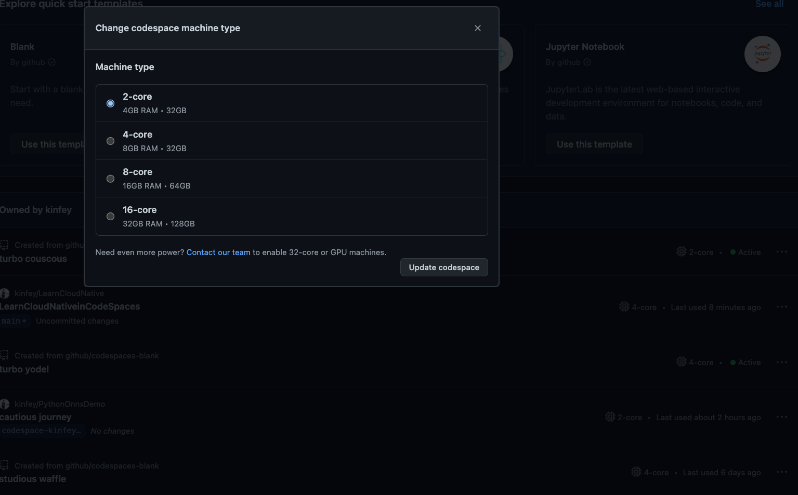

# **Build machine learning  on GitHub Codespaces**

On GitHub Codespaces, you can build machine learning environments based on existing templates or according to your own needs with blank template.


Of course, this is an environment that does not include a GPU. If you need a GPU, you must apply for it additionally. This already includes Python, and related libraries.

Or I prefer to build the environment by myself, I prefer to use empty templates to build my own environment, such as .NET machine learning, such as libraries with Azure, etc.


To build a machine learning environment by yourself, the required steps are as follows:

**1. Select the "Miniconda (Python 3)" project**


**2. And switch the machine configuration to 4-core CPU, 8GB memory, 32GB storage**





**3. Add support for different SDKs and locales**

Azure related such as Azure CLI


After  successful, you can refer to the following devcontainer.json configuration

```json

{
	"name": "Miniconda (Python 3)",
	"build": { 
		"context": "..",
		"dockerfile": "Dockerfile"
	},
	"features": {
		"ghcr.io/devcontainers/features/azure-cli:1": {},
		"ghcr.io/devcontainers/features/node:1": {}
	}


}

```


**5. Add the extensions you need directly to the container**

Azure Machine Learning plugin, which can be directly added to devcontainer.json through extensions settings


**6. Additional environment configuration**

You can add extensions for Azure ML CLI v2

Complete related calls by adding execution scripts under devcontainer.json

```json


	"onCreateCommand": "az extension add -n ml",

```

这是最后完成的 devcontainer.json

```json

// For format details, see https://aka.ms/devcontainer.json. For config options, see the
// README at: https://github.com/devcontainers/templates/tree/main/src/ubuntu
{
	"name": "Miniconda (Python 3)",
	"build": { 
		"context": "..",
		"dockerfile": "Dockerfile"
	},
	"features": {
		"ghcr.io/devcontainers/features/azure-cli:1": {},
		"ghcr.io/devcontainers/features/node:1": {}
	},
	"onCreateCommand": "az extension add -n ml",
	"customizations": {
		"vscode": {
			"extensions": [
				"ms-toolsai.vscode-ai"
			]
		}
	}
}

```


**6. Rebuild Your codespaces**

## **About the environment configuration of machine learning**


1. Python - You can complete different versions of conda installation through miniforge

```

conda create -n pydev python=3.8.10

```

2. Python Library

```bash

pip3 install numpy scipy scikit-learn matplotlib pandas pillow jupyterlab jupyter

```

3. Machine Learning / Deep Learning 


```bash

pip3 install tensorflow

pip3 install torch torchvision torchaudio --extra-index-url https://download.pytorch.org/whl/cpu

```


## **Resources**


0. Sign up your GitHub https://github.com/signup

1. Learn about GitHub Codespaces https://github.com/features/codespaces

2. Learn Tensorflow https://learn.microsoft.com/en-us/training/paths/tensorflow-fundamentals/

3. Learn PyTorch https://learn.microsoft.com/en-us/training/paths/pytorch-fundamentals/


