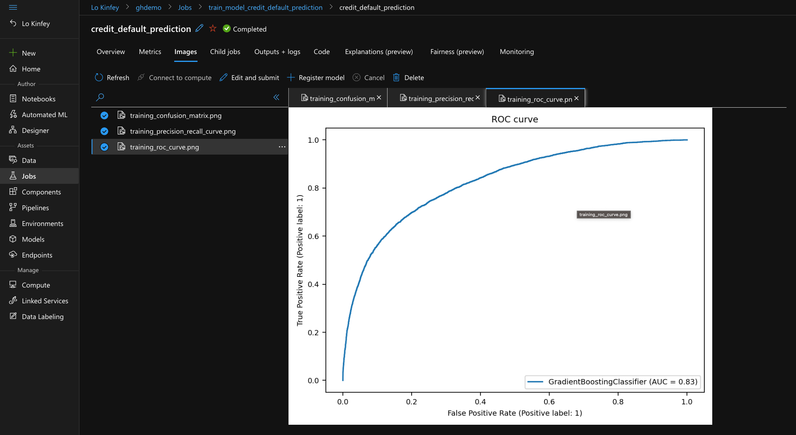

# **Machine learning through Azure ML in GitHub Copespaces**

Machine learning is inseparable from relevant hardware resources. After all, it needs to use a large amount of data and different computing power, so the assistance of the cloud is essential. We can use Azure ML to assist us in completing machine learning tasks.


## **What is Azure Machine Learning**

Azure Machine Learning empowers data scientists and developers to build, deploy, and manage high-quality models faster and more confidently. It leverages industry-leading machine learning operations (MLOps), open source interoperability and integrated tools to accelerate time to value. This trusted platform is purpose-built for responsible AI applications in machine learning.

With Azure Machine Learning Studio, you can manage all processes of machine learning more efficiently.


You can manage your machine learning on GitHub codespaces. The relevant environment configuration has been completed in the previous environment configuration. You can directly access your machine learning environment. Of course, don’t forget to install it, azureml sdk

```bash

pip3 install azure-ai-ml

```

## **Next, let's do a simple experiment**

Please refer to https://learn.microsoft.com/en-us/azure/machine-learning/tutorial-azure-ml-in-a-day to build a notebook




or use this link https://github.com/kinfey/AzureMLWithCodespace/blob/master/Notebooks/01.pytorch_demo.ipynb to test


## **Resources**


0. Sign up your GitHub https://github.com/signup

1. Learn about GitHub Codespaces https://github.com/features/codespaces

2. Learn Azure Machine Learning https://learn.microsoft.com/en-us/training/paths/use-azure-machine-learning-pipelines-for-automation/