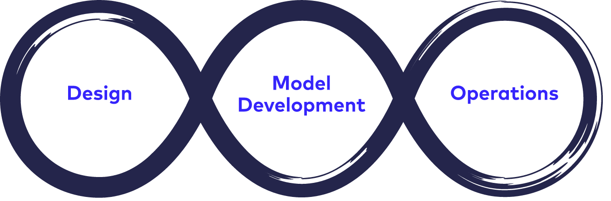
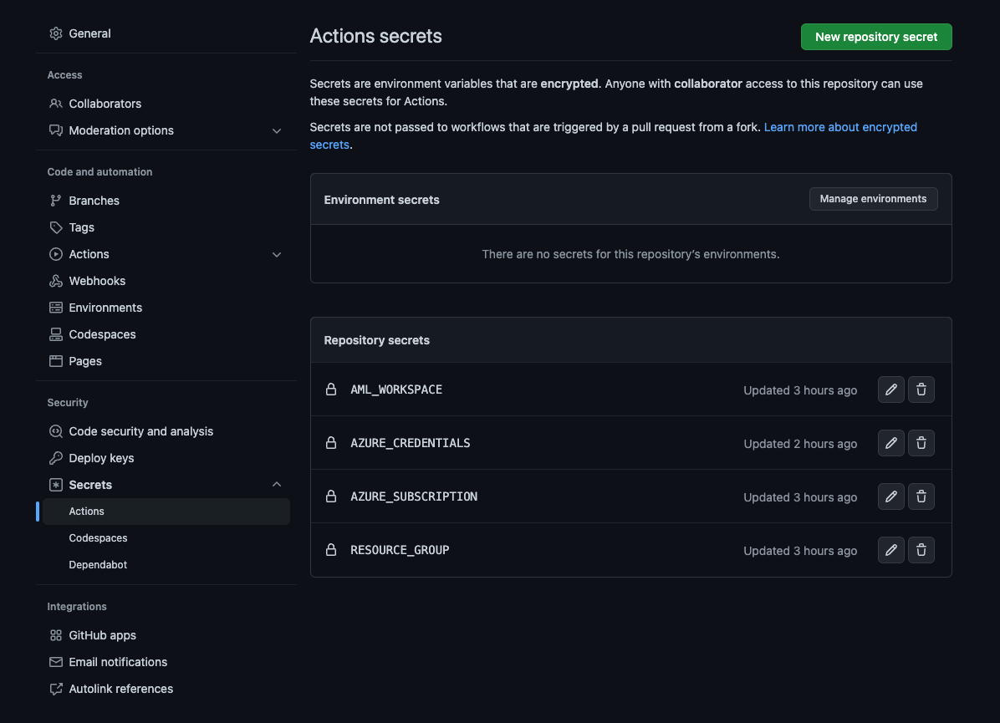
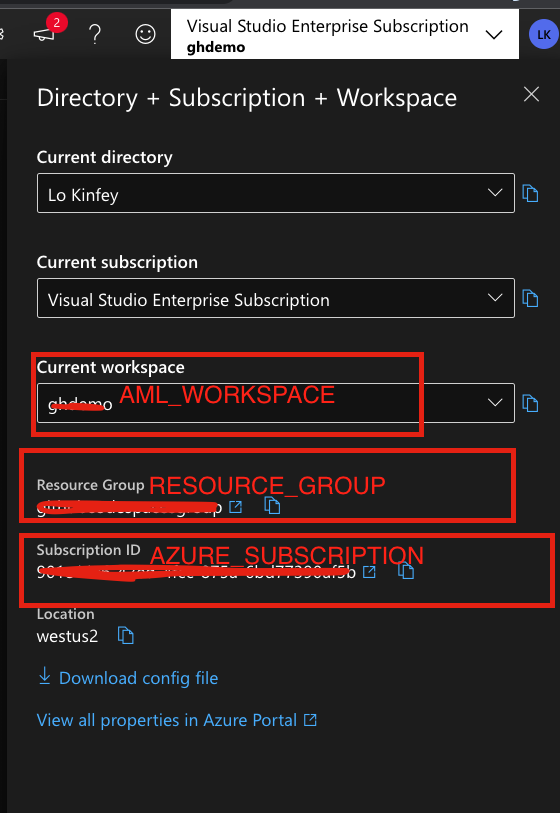
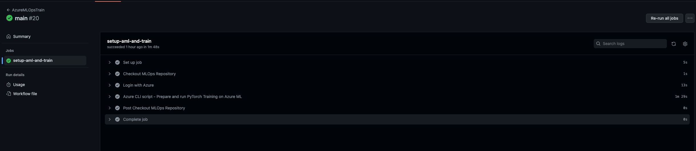
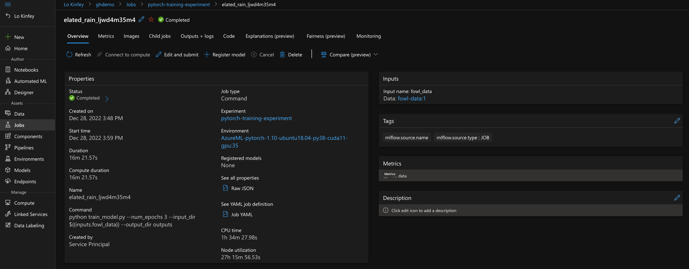

# **MLOps Development Tips**

## **What is MLOps？**




MLOps is based on DevOps principles and practices that improve workflow efficiency. Examples include continuous integration, continuous delivery, and continuous deployment. MLOps applies these principles to the machine learning process with the goals of:

Experiment and develop models faster.
Deploy models to production faster.
Quality assurance and end-to-end real-time tracking.

## **MLOps in Machine Learning**

Machine learning provides the following MLOps capabilities:

Create reproducible machine learning pipelines. Use machine learning pipelines to define repeatable and reusable steps for data preparation, training, and scoring processes.

Create reusable software environments. Use these environments to train and deploy models.

Register, package and deploy models from anywhere. You can also track the associated metadata required to use the model.

Capture governance data for the end-to-end machine learning lifecycle. Recorded lineage information can include who published the model and why changes were made. Also includes when the model is deployed or used in production.

Get notifications and alerts for events in the machine learning lifecycle. Examples of events include experiment completion, model registration, model deployment, and data drift detection.

Monitor operations and machine learning-related issues in machine learning applications. Compare model inputs between training and inference. Explore model-specific metrics. Provides monitoring and alerting information about your machine learning infrastructure.

Automate the end-to-end machine learning lifecycle using machine learning and Azure Pipelines. By using pipelines, the model can be updated frequently. New models can also be tested. New machine learning models can be rolled out continuously along with other applications and services.


## **GitHub + Azure ML = MLOps**

GitHub is no longer just a code storage tool, it has many functions, such as GitHub Actions, GitHub Codespaces, and different project management. I really like GitHub, and as the most important development platform.


From the previous chapter, we learned that Azure Machine Learning is a very good MLOps platform, and integrating GitHub can better maintain our machine learning projects.

We can enter the world of MLOps by forking this project https://github.com/kinfey/AzureMLWithCodespace

Specific operations (this example depends on the previous machine learning environment configuration, if you have not completed the configuration, please go back to the previous reference for related operations)

1. Data upload

Download the data by executing download-data.py under the MLOps folder, and then upload it to your Azure ML platform,

```bash

az ml data create --file data.yml --resource-group my-resource-group --workspace-name my-workspace

```

2. Go to GitHub and set different keys




AML_WORKSPACE，AZURE_SUBSCRIPTION，RESOURCE_GROUP 



run this command

```bash

az ad sp create-for-rbac --name $AML_SP \
  --role contributor \
  --scopes /subscriptions/SUBSCRIPTIONID/resourceGroups/my-resource-group  \
  --sdk-auth

```

Set AZURE_CREDENTIALS

Once done, you can run

1. Here I want to explain that you can change each environment configuration. Azure ML is set based on the yml file. For details, you can refer to https://learn.microsoft.com/en-us/azure/machine- learning/reference-yaml-overview

2. We can now integrate data, training, and deployment with Azure ML through GitHub Actions



<br/>




## **Resources**

1. Learn about Azure ML v2 https://learn.microsoft.com/en-us/azure/machine-learning/concept-v2

2. Understand the use of GitHub Actions https://github.com/features/actions

