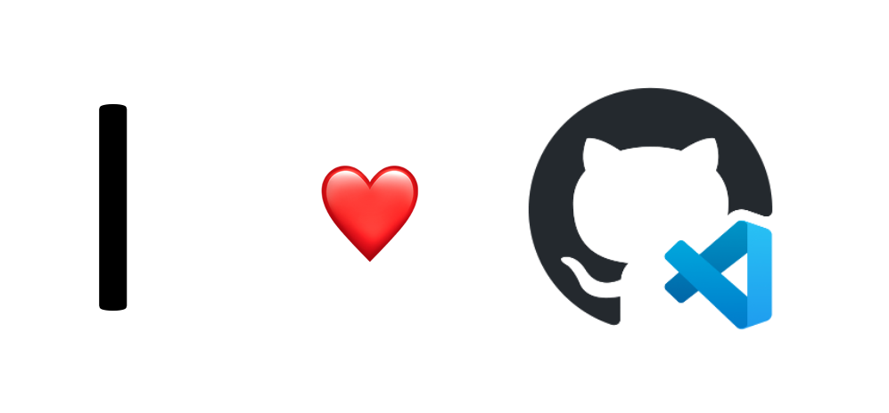

# **GitHub Codespaces Workshop**

大家好，这是基于 GitHub Codespaces 的线上 Workshop，希望通过结合不同的内容告诉大家如何应用 GitHub Codespaces ，如何结合 GitHub Codespaces 作为自己的学习编程语言的平台，还有通过 GitHub Codespaces 维护你的项目等内容。

## **GitHub Codespaces 介绍**

或者你已经从 GitHub Universe 2022 上知道 GitHub Codespace 每个月免费 60 小时的消息，但如何使用 GitHub Codespaces 呢？如何配置好你的 GitHub Codespaces 环境 ？GitHub Codespaces 的工作原理是什么？
通过本章课程学习，你可以掌握以下内容

1. 什么是 GitHub Codespaces ？
2. 如何使用 GitHub Codespaces ？
3. 通过 GitHub Codespaces 的模版构建你的 Python 项目
4. 通过 GitHub Codespaces 的空模版构建你的 .NET 项目

学习时间： 40 min

相关内容：（<a href="./00.Introduction.md">点击进入学习</a>）

## **通过 GitHub Codespace 学习编程语言**

学习编程语言是开启编程之路上非常重要的一步，我们在学习编程语言时，我们必须要安装不同的环境包括 SDK，包括一些库，以及 IDE 上的插件等。这会占用我们非常大的时间。有时候你会遇到各种不兼容的内容，这个时候我们就可以结合 GitHub Codespaces 启动一个开箱即用的开发环境，让作为初学者的你快速进入到编程中，体验不同编程语言的编程乐趣。通过本章学习你可以掌握以下内容：

1. 通过 GitHub Codespaces 学习 .NET （<a href="./01.LearnCSharp.md">点击进入学习</a>）
2. 通过 GitHub Codespaces 学习 Java （<a href="./01.LearnJava.md">点击进入学习</a>）
3. 通过 GitHub Codespaces 学习 Python(更新ing)
4. 通过 GitHub Codespaces 学习 Rust(更新ing)
5. 通过 GitHub Codespaces 学习 Go(更新ing）
6. 通过 GItHub Codespaces 学习 NodeJS(更新ing)

学习时间： 180 min

## **通过 GitHub Codespaces 做云原生应用(更新 ing)**
## **通过 GitHub Codespaces 做机器学习(更新 ing)**
## **通过 GitHub Codespaces 维护你的项目(更新 ing)**